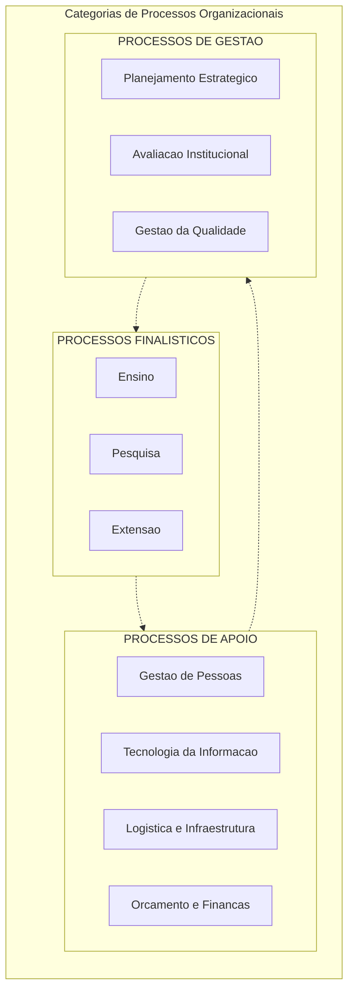
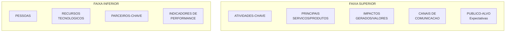
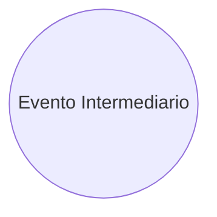
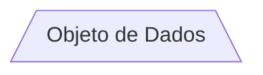
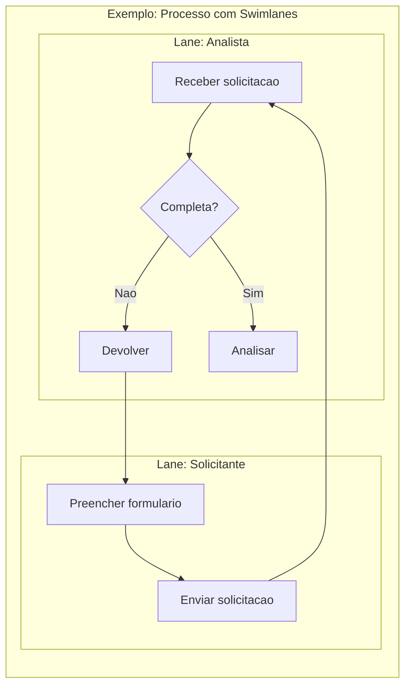
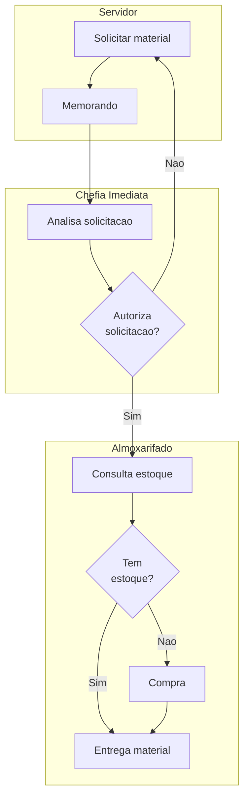
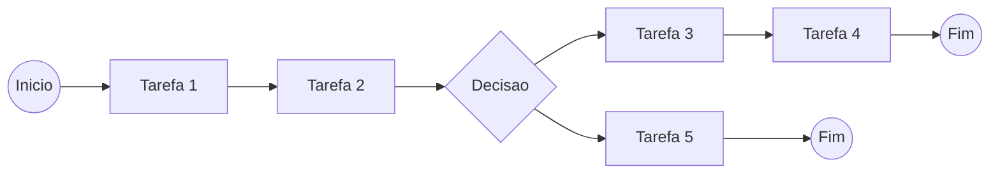
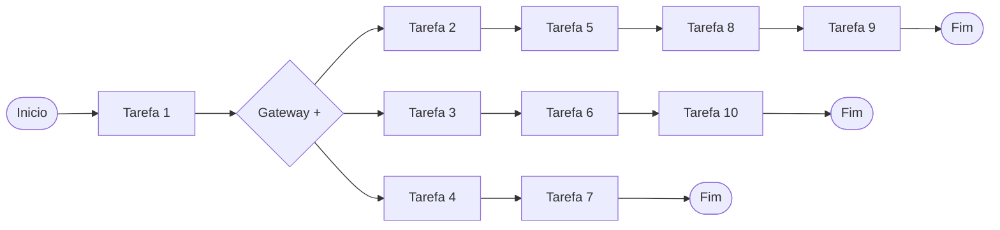

GUIA DE MAPEAMENTO

DE PROCESSOS

– UFSM –


<!-- [IMAGE: Brasao da UFSM - Capa] -->


<!-- [IMAGE: Barra institucional UFSM] -->

---

FRANK LEONARDO CASADO

EVANDRO GOMES FLORES
DANIELE MEDIANEIRA RIZZETTI

TAIANI BACCHI KIENETZ

RAFAEL FELIN NEVES
REGIS SIMEÃO SALDANHA FAGUNDES

## GUIA DE MAPEAMENTO
DE PROCESSOS
– UFSM –

2ª edição

Santa Maria, 2019

---


<!-- [IMAGE: Logo do Programa de Modernizacao Administrativa] -->

---

# SUMÁRIO

# INTRODUÇÃO ............................................................................................................................................ 6

# Capitulo 1 | CONCEITO E DEFINIÇÕES .................................................................................................... 7

1.1. Categorias de Processos Organizacionais: ..................................................................................... 8

1.2. Hierarquia da Cadeia de Valor ........................................................................................................ 9

# Capitulo 2 | METODOLOGIA DE MAPEAMENTO DE PROCESSOS ......................................................... 11

2.1. Definição da Cadeia de Valor e da Missão da Organização .................................................. 12

2.2. Coleta de Informações e Priorização ............................................................................................ 14

2.3. Desenho dos Processos .................................................................................................................... 17

2.4. Redesenho e Otimização dos processos ...................................................................................... 19

# Capitulo 3 | NOTAÇÃO DE MODELAGEM DE PROCESSOS ................................................................... 21

3.1. Elementos da Notação .................................................................................................................... 21

3.1.1. Eventos: ........................................................................................................................................ 21

3.1.2. Atividades: ................................................................................................................................... 24

3.1.3. Decisões: ...................................................................................................................................... 25

3.1.4. Objetos de Conexão: ................................................................................................................ 26

3.1.5. Swimlanes: ................................................................................................................................... 27

3.1.6. Artefatos: ..................................................................................................................................... 28

3.2. Modelagem de Processos ............................................................................................................... 28

3.2.1. O que é Diagrama de Processo? ............................................................................................ 28

3.2.2. O que é um Mapa de Processo? ............................................................................................ 29

3.2.3. Qual o Propósito da Modelagem de Processos? ................................................................. 30

3.2.4. Tipos de Modelagem ................................................................................................................ 30

3.2.5. Modelagem Sequenciada ....................................................................................................... 31

3.2.6. Modelagem AD HOC ................................................................................................................ 33

3.2.7. Processos Ponta a Ponta .......................................................................................................... 34

3.3. Sugestões de Nomes Apropriados para Processos de Negócio ............................................... 34

# Capitulo 4 | TRANSFORMAÇÃO DE PROCESSOS .................................................................................. 35

4.1. O que é Transformação de Processos ........................................................................................... 35

4.2. Amplitudes de Transformação ........................................................................................................ 36

4.2.1. Melhoria de Processos ............................................................................................................... 37

4.2.2. Redesenho de Processos .......................................................................................................... 39

4.2.3. Reengenharia de Processos ..................................................................................................... 40

4.2.4. Mudança de Paradigma .......................................................................................................... 41

4.2.5. Por que redesenho, reengenharia ou mudança de paradigma? Por que melhoria não
é suficiente? .............................................................................................................................................. 42

4.2.6. Modernização da Operação .................................................................................................. 45

4.2.7. Comprometimento Gerencial ................................................................................................. 45

4.2.8. Atividades do Gerenciamento de Mudança ....................................................................... 46

---

4.2.9. Superando a resistência à mudança ..................................................................................... 47

4.2.10. Envolvimento das partes interessadas .................................................................................. 48

4.2.11. Adotando foco no cliente ...................................................................................................... 50

# BIBLIOGRAFIA .......................................................................................................................................... 53

ANEXOS ................................................................................................................................................... 54

# ANEXO 1 | DIRETRIZES E PARÂMETROS DE ESTRUTURAS E PROCESSOS – PROPLAN ......................... 54

# ANEXO 2 | Boas Práticas ......................................................................................................................... 58

---

# INTRODUÇÃO

O Guia de Mapeamento de Processos da UFSM constitui-se de um documento

técnico de definição dos principais conceitos e procedimentos adotados para o

mapeamento de processos institucionais.

Processos institucionais podem ser considerados como o agrupamento e

organização de atividades correlatas para atingir um objetivo específico.

O trabalho de mapeamento de processos se insere no Programa de

Modernização Administrativa da Pró-Reitoria de Planejamento e procura atender aos

requisitos técnicos necessários para a implementação da gestão de processos na

universidade.

O documento está dividido em quatro capítulos, sendo que o primeiro capítulo

procura balizar os conceitos relacionados ao tema; o segundo capítulo descreve a

metodologia de mapeamento de processos, que passa pelo entendimento da cadeia

de valor da unidade, da coleta de dados, do desenho dos processos e da otimização e

redesenhos dos mesmos; o capítulo 3 apresenta a definição dos principais elementos

usados no mapeamento de processos de acordo com o software Bizagi; e, por fim, o

quarto capítulo abordar conceitos relacionados ao tema transformação de processos.

---

# Capitulo 1 | CONCEITO E DEFINIÇÕES

Processo organizacional é um conjunto de atividades logicamente inter-

relacionadas, que envolve pessoas, equipamentos, procedimentos, tecnologias e

informações e, quando executadas, transformam entradas em saídas, agregam valor e

produzem resultados, repetidas vezes (MPF/PGR, 2013).

Esse conceito traz a ideia de processo como fluxo de trabalho - com insumos e

produtos/serviços claramente definidos e atividades que seguem uma sequência lógica

e que dependem umas das outras numa sucessão clara – denotando que os processos

têm início e fim bem determinados e geram resultados para o público interno e usuários

do serviço, alinhados à missão institucional.

### Figura 01: Os processos organizacionais

Fonte: Elaborado pelos autores.

Um processo organizacional se caracteriza por:

 Ter claras as fronteiras (início e fim) e seu objetivo;

 Ter claro aquilo que é transformado na sua execução;

 Definir como ou quando (circunstância) uma atividade ocorre;

 Ter um resultado específico;

 Listar os recursos utilizados para a execução da atividade;

 Ter gerenciabilidade, ou seja, responsável definido e problemas conhecidos e

acompanhados;

 Ter efetividade quanto às relações com usuários e fornecedores e seus requisitos

são claramente definidos;

 Ter transferibilidade e rastreabilidade, ou seja, ser devidamente documentado;

 Ser mensurável, possuindo pontos de controle e medidas de eficácia/eficiência;

 Ter alterabilidade, por meio de mecanismos de feedback para melhoria; e

 Permitir o acompanhamento ao longo da execução.


<!-- [IMAGE: Icone ilustrativo da secao de Introducao] -->

Organização

### Insumo
Processos
Produtos ou

serviços


<!-- [IMAGE: Barra decorativa] -->

Missão

---

### 1.1. Categorias de Processos Organizacionais:

Utilizando-se dos conceitos de Araújo et all (2017), Valle e Oliveira (2009), e o que

estabelece a Arquitetura PCF 7.0.0 da Process Classification Framework da American

Productivity and Quality Control (APQC, 2017) e BPMN 2.0 (2011), os processos

organizacionais podem ser classificados em três categorias:

 Processos Gerenciais: são aqueles ligados à estratégia da organização. São

processos gerenciais ou de informação e de decisão, que estão diretamente

relacionados à formulação de políticas e diretrizes para o estabelecimento e

consecução de metas; bem como ao estabelecimento de métricas

(indicadores de desempenho) e às formas de avaliação dos resultados

alcançados interna e externamente à organização (planejamento estratégico,

gestão por processos e gestão do conhecimento são exemplos de processos

gerenciais).

 Processos Finalísticos ou Primários: referem-se à essência do funcionamento da

organização. São aqueles que caracterizam a atuação da organização e

recebem apoio de outros processos internos, gerando o produto para o cliente

interno ou usuário. Os processos organizacionais enquadrados nesta categoria

estão diretamente relacionados ao objetivo da instituição.

 Processos de Suporte ou Apoio: são processos essenciais para a gestão efetiva

da organização, garantindo o suporte adequado aos processos finalísticos.

Estão diretamente relacionados à gestão dos recursos necessários ao

desenvolvimento de todos os processos da instituição. Os seus produtos (bens ou

serviços) se caracterizam por terem como clientes, principalmente, elementos

pertinentes ao sistema (ambiente) da organização.

Os processos finalísticos ou primários, de fato são os mais importantes numa

organização, pois afetam diretamente o público-alvo ou clientes da mesma. Neste

sentido, os processos finalísticos podem ser subdivididos, conforme Valle e Oliveira (2009),

em processos chave e críticos.

Os processos chave são aqueles que apresentam alto custo para a organização

e alto impacto para os clientes externos. Entre os processos chave estão os críticos. Mas,

nem todos os processos chave são críticos, pois os processos críticos são aqueles que têm

relação direta com a estratégia de negócio da sua empresa, são os que estão

diretamente alinhados com a estratégia, com a missão institucional.

---

### 1.2. Hierarquia da Cadeia de Valor

A ideia da cadeia de valor surgiu da análise de valor, que é a percepção de que

existem processos que mais agregam valor e mais contribuem para a qualidade do

serviço/produto, com vistas à satisfação do cliente/usuário. Nesta ideia, a cadeira de

valor consiste numa cadeia de atividades relacionadas e desenvolvidas por uma

instituição que busca satisfazer de forma mais completa as necessidades de seu público-

alvo (BRASIL, 2013).

Dessa forma, a cadeia de valor pode ser entendida como a descrição

(geralmente gráfica) dos componentes básicos da operação numa organização e dos

relacionamentos entre eles, demonstrando como a organização concretiza seus

objetivos e sua missão, permitindo ter uma visão sistêmica do negócio, desde o nível

macro até a descrição detalhada das atividades (PAIM, 2009).

Nesta lógica, os processos podem se apresentar da seguinte forma hierárquica,

(ARAUJO et all, 2017; VALLE & OLIVEIRA, 2013):

 Macroprocesso: geralmente envolve mais de uma função organizacional cuja

operação tem impacto significativo no modo como a organização funciona.

Exemplo: Macroprocesso de Gestão de Estratégica.

 Processo: consiste num grupo de tarefas interligadas logicamente, que utilizam

recursos da organização para gerar resultados. São operações de alta

complexidade (subprocessos, atividades e tarefas distintas e interligadas),

visando cumprir um objetivo organizacional específico. Exemplo: Avalição

Institucional, Planejamento Estratégico.

 Subprocesso: está incluído em outro subprocesso, ou seja, um conjunto de

operações de média a alta complexidade (atividades e tarefas distintas e

interligadas), realizando um objetivo específico em apoio a um processo.

Exemplo: curso de capacitação em planejamento estratégico.

 Atividades:
são
operações
ou
conjuntos
de
operações
de
média

complexidade, que ocorrem dentro de um processo ou subprocesso,

geralmente desempenhadas por uma unidade organizacional determinada e

destinada a produzir um resultado específico. Exemplo: preparar o conteúdo do

curso, realizar o curso.

 Tarefas: nível mais detalhado das atividades, é um conjunto de trabalhos a

serem executados, envolvendo rotina e prazo determinado, corresponde a um

---

nível imediatamente inferior ao de uma atividade. Exemplo: enviar

apresentação do Powerpoint para o portal Moodle.

A figura a seguir demonstra a hierarquia mencionada:

### Figura 02: Hierarquia da Cadeia de Valor

Fonte: elaborado pelos autores.


<!-- Figura: Categorias de Processos Organizacionais -->




<!-- [IMAGE: Barra decorativa inferior] -->

Missão

### Macroprocessos
Processos
Subprocessos
Atividades
Tarefas

---

# Capitulo 2 | METODOLOGIA DE MAPEAMENTO DE PROCESSOS

A metodologia de mapeamento de processos na UFSM utilizar-se-á como base

conceitual e metodológica a Business Process Model and Notation (BPMn 2.0).

De acordo com BPMN (2011) o BPMN constitui um conjunto de capacidades de

negócio para identificar, desenhar, executar, documentar, medir, monitorar, controlar e

melhorar processos de negócio, automatizados ou não, para alcançar resultados

consistentes e alinhados com os objetivos estratégicos da organização. O que implica

num comprometimento contínuo das organizações incluindo um conjunto de atividades

tais como modelagem, análise, desenho, medição de desempenho e transformação de

processos. Envolve uma continuidade, um ciclo feedback sem fim para assegurar que os

processos de negócio estejam alinhados com a estratégia organizacional e com o

público-alvo.

O BPMN tem como finalidade acompanhar, após definidas as prioridades, como

os recursos de uma organização, são aplicados e transformados em ações para o

alcance das metas organizacionais (Pradella, 2016).

Na metodologia proposta pela UFSM, o mapeamento de processos passa pela

identificação do negócio da unidade, ou seja, a forma como ela gera e entrega valor

para seu público-alvo. Esta identificação permite estabelecer a lógica da cadeia de valor

necessária para o alinhamento entre os processos da unidade e a estratégia da

instituição. Outra fase consiste no mapeamento das ações, atividades, tarefas ou

processos executados pela unidade, ou planejados para serem executados, com o

objetivo de se obter um conhecimento da organização e possibilitar a priorização

daquelas atividades/processos que irão compor a próxima fase.

Após a identificação da cadeia de valor, das atividades/processos chave, o

próximo passo consiste no mapeamento e detalhamento dos processos, tal qual são

executados ou foram concebidos pelos responsáveis pelos mesmos, possibilitando um

entendimento da situação atual (AS IS), e assim obtendo-se as melhores práticas, e

possibilitando a identificação e a definição de soluções para os problemas atuais. Por fim,

estas etapas permitem a realização do redesenho e da otimização dos processos com

proposta futura (TO BE) dentro da lógica macro de cadeia de valor da instituição.

---

### Figura 03: Etapas do mapeamento de processos institucionais

Fonte: elaborado pelos autores.

A seguir são apresentadas as etapas do processo:

### 2.1. Definição da Cadeia de Valor e da Missão da Organização

Segundo Araújo (2017) na gestão de processos a cadeia de valor é um elo

importante entre as estratégias da organização e suas atividades, ou melhor, seus

processos. Na definição da cadeia de valor um fator fundamental é o conhecimento da

missão da organização.

Com relação à missão, “é a definição do propósito da organização, o que a

empresa deseja atingir em um ambiente maior” Araújo (2017) apud (KOTLER;

ARMSTRONG, 2007). Dessa forma, a missão determina o foco nas tomadas de decisões e

nas alocações de recursos do presente, orientando priorizações para aquelas que

contribuem com a razão de ser da empresa, sua missão.

O correto gerenciamento de uma Cadeia de Valor pode se tornar um diferencial

estratégico para o alcance dos resultados institucionais, por meio da identificação e

eliminação de atividades que não adicionam valor à sociedade e à missão da instituição.

Assim sendo, trabalhar uma estratégia, considerando como parâmetro a cadeia de valor,

pode se configurar na diferença entre o sucesso e o fracasso da iniciativa de gestão por

processos, uma vez que leva em consideração todas as etapas do processo de trabalho

da organização (PRADELLA, 2016).

Nesta etapa, a ferramenta de gestão utilizada é uma adaptação da metodologia

conhecida como Processes Analysis Model Canvas (tradução: Análise de Processos

Modelo Canvas) o qual foi desenvolvido pelo professor Wellington P. L. Silva com base no

modelo “Business Model Canvas”, conforme Silva (2016) apud (Osterwalder, 2011) esta é

uma ferramenta de gerenciamento estratégico, que permite desenvolver e esboçar a

Definição da cadeia

de valor

Coleta de
informações

Desenho dos

processos

Redesenho e
Otimização dos

processos

---

forma como a organização gera e entrega valor para o seu público alvo, bem como é

capaz de identificar os principais processos que agregam valor à missão da organização.

Essa interação proposta pelo método PAMC é obtida a partir da realização de um

brainstorming, com os principais envolvidos no processo, onde o PAMC é construído em

## 09 blocos de análise que podem ser visualizados numa única folha de papel (figura 04).

### Figura 04: PMC-CANVAS
Fonte: Elaborado pelos autores com base em Silva (2016).

A construção do quadro PMC-CANVAS apresenta os seguintes quadros:

1. Público-Alvo: onde devem ser descritos e caracterizados todos os atuais usuários

que são foco da organização. O mapeamento do público-alvo deve identificar

as principais necessidades a serem atendidas e quais seriam as expectativas dos

mesmos no atendimento de suas necessidades.

Para tanto algumas questões podem ajudar no preenchimento, tais como:

 Quem são os atuais usuários dos serviços/produtos de sua unidade?

 Quais as características destes usuários?

 Quais são suas necessidades?

 Quais são suas expectativas relacionada ao atendimento de suas

necessidades?

2. Impactos gerados ou valores gerados pela organização: uma vez mapeado as

necessidades e expectativas do público-alvo, a identificação dos impactos a


<!-- Figura 04: PMC-CANVAS - Canvas de analise de processos com 9 blocos -->



---

serem gerados ou valores a serem trabalhos pela organização ficam mais claros.

Nesta etapa é importante o entendimento de quais são os valores são mais

impactantes para o público-alvo e os que geram valor para a organização no alcance

da missão institucional.

3. Atividades-Chave: São as atividades que mais contribuem para gerar o valor

para o público-alvo, ou as que mais contribuem para o atendimento das

necessidades e expectativas deste público, bem como as que mais impactam

no alcance da missão institucional.

4. Serviços/Produtos Chave: decorrentes das atividades-chave, são as entregas

traduzidas em serviços ou produtos específicos.

5. Canais de Comunicação/Relacionamento: traduzem a forma como a

organização se comunica com o público-alvo e como estabelecimento um

canal de troca da informações e relacionamento.

6. Pessoas: este quadro identifica o perfil da equipe necessária para atender às

atividades-chave.

7. Recursos Tecnológicos: este quadro identifica o quais são as ferramentas

(hardware ou software) necessárias para atender às atividades-chave.

8. Parceiros-Chave: são as entidades internas ou externas à organização que mais

impactam na geração de valor e no alcance às necessidades e expectativas

do público-alvo.

9. Indicadores de Performance: neste quadro devem ser identificados os

indicadores necessários para se acompanhar os resultados gerados pela

organização no atendimento ao público-alvo e à missão institucional.

### 2.2. Coleta de Informações e Priorização

Utilizando-se da ferramenta 5W2H em conjunto com a metodologia MASP

(Método de Análise e Solução de Problemas), a próxima etapa consiste na coleta de

informações da organização, em termos descritivos das atividades/processos e os

principais problemas e riscos na execução destas atividades/processos.

Nesta etapa utiliza-se formulário próprio, sendo respondido através de uma

entrevista dirigida. A entrevista dirigida (VALLE & OLIVEIRA, 2013), onde o entrevistador

estabelece um diálogo interativo com o entrevistado, permite visualizar as reações dos

---

### entrevistados, obter feedback rápido em caso de dúvidas, bem como permite grande
flexibilidade na estrutura original da entrevista.
Pergunta
Descrição

O quê?

Quais são as atividades/processos da unidade.
Ex.: Elaborar relatório, Organizar concurso público, Realizar

empenho,...

Por quê?

Por que esta atividade/processo é realizado na sua

unidade.
Elencar as necessidades dos usuários, demandas legais e

outras razões relevantes

Usuários?
Quem são os principais usuários/beneficiários ou

demandantes da atividade/processo?

Como?
Descreva como a atividade/processo é executado.

Não necessita de um alto grau de detalhamento.

Quem? Onde?

Setor Responsável
Citar o setor responsável pela atividade/processo

Setores envolvidos
Citar os demais setores envolvidos

Quando?

Sazonalidade
A atividade/processo é sazonal ou rotineira?

Duração
A atividade/processo dura quanto tempo? 1hora, 2 horas,

indefinido?

Quantas vezes ao

ano ocorre a
atividade/processo?

Quantas vezes o ciclo de início e fim da
atividade/processo acontece durante o ano ou dia? Ex.: 3

vezes ao dia, 2 vezes ao ano, 5 vezes no mês

Quanto?

Custo?
Existem alguma previsão de custo da atividade/processo?

Sim ou não

Se sim, quanto

custa?
Ex.: R$ 20 mil reais

Informatização

O processo foi

mapeado?
Sim ou não

O processo está
informatizado?
Sim ou não

O processo pode
ser informatizado?
Sim ou não

Ferramentas

Utiliza alguma
ferramenta de

Tecnologia?

Sim ou não

Necessita de
alguma ferramenta?

Qual?

Sim ou não. Ex.: Planilhas Excel, software SSA, ...

### Quadro 01: Modelo de 5W2H

Fonte: elaborado pelos autores.

### Nesta etapa também são coletas informações sobre o nível de complexidade e

### de relevância do processo, tanto de acordo com a visão dos participantes do processo,

---

### quanto no entendimento da equipe técnica, relacionado ao alinhamento com a cadeia
de valor e estratégica da organização.
Opinião dos participantes do processo

Grau de complexidade
Qual o grau de complexidade da atividade/processo?

1- Baixa 2-Moderada 3-Alta

Grau de Importância/relevância

O quanto o projeto é importante para o alcance da missão

da organização?
1- Pouco importante 2-indiferente 3-Muito Importante

Visão da equipe técnica

Grau de complexidade
Qual o grau de complexidade da atividade/processo?

1- Baixa 2-Moderada 3-Alta

Grau de Importância/relevância

O quanto o projeto é importante para o alcance da missão

da organização?
1- Pouco importante 2-indiferente 3-Muito Importante

É um processo crítico?
Agrega valor aos usuários/público-alvo

1- Baixa 2-Moderada 3-Alta

### Quadro 02: Nível de complexidade e importância
Fonte: elaborado pelos autores.

### Ainda, com o objetivo de se identificar quais são os principais problemas e riscos

### que afetam a execução das atividades/processos, utiliza-se formulário próprio adaptado
da metodologia MASP e Matriz GUT.

Questão
Descrição

Problemas e riscos
Quais são os principais problemas desta

atividade/processo

Por que ocorre?
Por que este problema ocorre? Algum problema no

processo? Falta de controle?

Qual o efeito ou consequência disso?
O que pode acontecer se o problema persistir? Ou se o
risco se concretizar? Impacto legal, impacto no processo

Qual a gravidade deste problema/risco

SEM GRAVIDADE

POUCO GRAVE

GRAVE
MUITO GRAVE
EXTREMAMENTE GRAVE

Qual a urgência deste problema/risco?

NÃO TEM PRESSA
PODE ESPERAR UM POUCO

O MAIS CEDO POSSÍVEL
COM ALGUMA URGÊNCIA

AÇÃO IMEDIATA

Qual a tendência da não solução deste

problema/risco?

NÃO VAI PIORAR
VAI PIORAR EM LONGO PRAZO

VAI PIORAR EM MÉDIO PRAZO
VAI PIORAR EM POUCO TEMPO

VAI PIORAR RAPIDAMENTE

Qual a provável solução?
Existe solução aparente para este risco ou problema na

sua opinião?

### Quadro 03: Identificação de Riscos e Problemas
Fonte: elaborado pelos autores.

---

### 2.3. Desenho dos Processos
Com o roteiro do processo preenchido, a equipe técnica, finalmente, parte para

### a modelagem do fluxo das atividades. Nesta etapa a utilização de entrevistas dirigidas,

### reuniões, e formulários servirão de apoio para o desenho e modelagem do processo,

### considerando o padrão de modelagem definido neste guia (Capítulo 3), com apoio do
software Bizagi.

### A etapa inicial consiste na definição das tarefas, documentações e requisitos de

### um processo. Para tanto o quadro a seguir exemplifica o padrão de informações para
entendimento da tarefa.

DADOS DO PROCESSO
Código
Macroprocesso
Gestão Operacional

Processo
Versão

Sub-processo
Versão

Entrada (início
do processo)

Saída (saída do
processo)

Clientes/usuário
s

Periodicidade

Indicador
(existente)

Sistema de
apoio

Base legal

ALINHAMENTO ESTRATÉGICO
Desafio
Estratégico PDI

Objetivo
Estratégico PDI

GERENTE DO PROCESSO
Nome
E-mail

Cargo
ANALISTA(S) DO PROCESSO
Nome
Nome
DEGINER DO PROCESSO
Nome
ATIVIDADES

Ordem
Tipo
Nome da Tarefa/Decisão
Descrição
Executor/Responsável
Documentos
Tempo

Tarefa/
Decisão
Nome da tarefa

Descrição de

como é
executada a

tarefa ou de
como é realizada

a devisão

Órgão
responsável
pela tarefa ou

decisão

Documentos usados na

tarefa ou na tomada
de devisão: formulário,

memorando, manual,

etc.

Qual o
tempo
médio de
realização

da
atividade

?

---

...
Sugestão de melhorias
1
2
DE ACORDO

Data: _____________/_____________/_____________

Assinatura do Gerente do Processo
Assinatura do Analista do Processo

### Quadro 04: Formulário de Descrição do Processo

Fonte: elaborado pelos autores.

Nesta etapa ainda serão identificados as responsabilidades e papéis necessários

para a execução do processo, conforme BPM CBOK v3.0, a seguir apresentada:

1.
Coordenador do macroprocesso: É o pró-reitor, o secretário especial ou

diretor responsável pela grande área de processos. Esse ator é responsável pelo sucesso

do desenvolvimento dos subprocessos. Deve estar atento aos processos que estão sob a

gestão de seus diretores e superintendentes.

2.
Gestor do processo ou subprocessos: É o responsável pelo alinhamento do

processo ou subprocessos à estratégia da organização, estabelecendo metas e

resultados esperados para o processo, assim como pela análise dos riscos envolvidos.

Deve ser preferencialmente um gestor de área (diretor ou superintendente). É a chefia

em nível intermediário que tem maior interesse e influência prática na execução do

processo. Deve acompanhar o cronograma e os resultados do mapeamento, além de

auxiliar na mobilização da equipe do projeto de mapeamento.

Cabe ainda ao gestor do processo ou subprocessos:

 Verificar se os processos estão produzindo os resultados previstos;

 Verificar se os sistemas informatizados estão de acordo com os processos

mapeados;

 Propor melhorias ou inovações, para tornar o processo mais eficiente e eficaz;

 Conduzir e integrar as atividades do processo; e

 Apresentar e difundir os objetivos do processo.

3.
Executor do processo: É o responsável pela implementação e melhoria

---

contínua de um ou mais processos, desdobrando as metas em itens de controles e

definindo ações de melhoria. Pessoa de referência encarregada pelo gestor do processo

para acompanhar e opinar ativamente no mapeamento. Esse ator trabalhará

intensamente com o modelador do processo para manter a mobilização da equipe,

proporcionando plenas condições de participação dos demais especialistas: usuários e

executores que fornecem conhecimento e experiência prática sobre o assunto,

garantindo uma análise sob a perspectiva do usuário final e valorizando percepções de

novas maneiras de atingir eficiência e eficácia operacional.

4.
Especialistas do processo: São os demais atores que interagem em partes

específicas do processo, sendo executores ou usuários, entendidos como fornecedores

e clientes, com conhecimento técnico ou capacidade crítica, identificados como atores

importantes na discussão e melhoria do processo em estudo.

5.
Os usuários do processo: para efeito de modelagem, são, em geral, agentes

intermediários com expectativas e requisitos próprios de seu local de trabalho. No

entanto, a perspectiva dos requisitos a serem plenamente atendidos devem sempre estar

orientados para o cliente final do processo, ou seja, o público a que o processo atende

com seu produto ou serviço final.

6.
Equipe de Tecnologia da Informação: É a equipe que fornece informações

sobre infraestrutura de Tecnologia da Informação (TI) e comunicação disponível, assim

como sua viabilidade para as soluções propostas nos processos correntes, relatando os

ajustes necessários para as modelagens sugeridas.

7.
Analista do processo: é o responsável pela coleta de informações,

elaboração de modelos e análise do processo de negócio na busca da otimização.

8.
Design do Processo: é o responsável por traduzir o conjunto de atividades no

desenho final do processo em software específico, com linguagem apropriada.

### 2.4. Redesenho e Otimização dos processos

De acordo com a cadeia de valor definida para toda a instituição, e de acordo

com todas as informações até aqui geradas, a próxima etapa constitui-se do estudo das

melhorias e alterações necessárias nos processos, subprocessos e macroprocessos

institucionais. Neste ponto, tais como as propostas apresentadas em Pradella et all (2016)

apud Campos (2007), o estudo deve basear-se no (a):

---

 Foco nas necessidades do cliente;

 Busca de benchmarking;

 Aplicação do conceito de multifuncionalidade;

 Eliminação de burocracia – remoção de aprovações desnecessárias,

assinaturas, número de vias, cópias etc.;

 Eliminação de duplicação – remoção de atividades idênticas ou similares que

ocorrem em mais de um ponto do processo;

 Avaliação do valor agregado – avaliar cada atividade do processo para

determinar sua contribuição para a satisfação do cliente. As atividades que

agregam valor são aquelas pelas quais o cliente pagaria;

 Simplificação – redução da complexidade do processo – facilitar a vida de

quem usa ou recebe produto/serviço;

 Redução de tempo de ciclo – determinação da maneira de reduzir o tempo

do processo para superar as expectativas do cliente e diminuir prazos de

estoque;

 Processos à prova de erros – tornar difícil ou impossível a ocorrência de erros no

processo;

 Padronização – escolher uma maneira de executar o processo, documentar e

fazer com que os funcionários façam sempre daquela maneira;

 Automação e mecanização – aplicação de equipamentos, ferramentas,

computadores para garantir a estabilidade do processo e aumentar

drasticamente seu desempenho;

 Questionamento do processo – se os itens anteriores não levam a grandes

melhorias, provavelmente todo o processo deve ser mudado ou até mesmo

extinto.

---

# Capitulo 3 | NOTAÇÃO DE MODELAGEM DE PROCESSOS

Modelo pode ser conceituado como uma representação abstrata e simplificada

de uma realidade em seu todo ou em partes, Oliveira et all (2013). Já, por modelagem de

processos, entende-se como sendo a identificação, o registro, a padronização e

documentação histórica da organização.

Para o mapeamento e modelagem de processos a ferramenta base utilizada

consiste na Notação de Modelagem de Processos de Negócio (BPMN) de acordo com

BPM CBOK versão 3.0 (ABPMP, 2013).

O BPMN foi desenvolvido pelo BMPI (Business Process Management Iniciative) e

começou a ser utilizado em 2004, em sua versão 1.0, sendo que no ano de 2006, a OMG

(Object Management Group) passou a ser a atual mantenedora da notação,

recebendo, mais recentemente em 2011, sua última versão, o BPMN 2.0.

Business Process Modeling Notation (BPMN) é uma notação gráfica que transmite

a lógica das atividades, as mensagens entre os diferentes participantes e toda a

informação necessária para que um processo seja analisado, simulado e executado.

Sendo assim, a notação usa um conjunto de figuras que permite diagramar

modelos de processos ajudando a melhorar a gestão de processos de negócios,

documentam o funcionamento real deles e consegue um desempenho melhor.

### 3.1. Elementos da Notação

A seguir estão detalhadas as informações sobre cada elemento que contém um

desenho de modelagem de processos, utilizados na notação BPMN 2.0 e presentes no

software Bizagi. Eles podem ser divididos em: eventos, atividades e decisões.

3.1.1. Eventos:

Acontece durante o curso do processo de negócio. Afetam o fluxo e pode ter

uma causa. Eventos são representados por círculos vazados para permitir sinalização que

identificarão os gatilhos ou resultados. Os tipos de eventos são: Início, Intermediário e Final.

Eventos de Início

Tipo nenhum: usual para início de processo, quando não
incorrer em nenhum dos tipos anteriores.


<!-- Simbolo BPMN: Evento de Inicio -->


---


<!-- Simbolo BPMN: Tarefa -->


<!-- Simbolo BPMN: Gateway Exclusivo -->


Mensagem de início: Significa que só será iniciado o
processo quando houver o recebimento de alguma
mensagem, seja via e-mail, fax, documento, etc.

Temporizador de início ou Timer: Indica que só será iniciado
o processo quando um tempo específico ou ciclo
ocorrerem. Exemplo: O processo pode ser ajustado para
iniciar-se sempre às segundas-feiras às 10:00.

Regra de início: Também chamada de condicional, é
utilizada para iniciar um processo quando uma condição
verdadeira for cumprida. Exemplo: Em um processo em que
o início seja um pedido de compras, fica condicionado a
realizar novo pedido, quando a quantidade em estoque for
inferior a 15%.

Sinal de início: Será utilizado quando houver uma
comunicação, seja entre os níveis do processo, pools ou
entre diagramas.

Múltiplo início: Quando existem várias maneiras de disparar
um processo. Mas apesar de haver múltiplas maneiras,
somente uma maneira inicia o processo.

Eventos Intermediários

Mensagem: indica que para dar continuidade ao fluxo, em
determinado ponto do processo, haverá o recebimento ou o
envio de uma mensagem (fax, documento, e-mail, etc.). O
envelope claro indica o recebimento da mensagem e o
escuro seu envio.

Temporizador: no meio do processo, o temporizador aponta
que quando ocorrer esse evento, o processo deverá aguardar
a data ou ciclo preliminarmente definidos. Enquanto não
ocorrido o tempo específico, o fluxo permanece parado.

Regra: Indica que, quando ocorrer esse evento no meio do
fluxo, o processo deverá aguardar a condição previamente
estabelecida se cumprir para dar continuidade. Enquanto não
cumprida, o fluxo permanece parado.

Link: Conecta as atividades de um mesmo processo,
objetivando deixar o diagrama mais limpo. A seta escura
indica envio do link e a clara indica o recebimento.


<!-- Simbolo BPMN: Evento de Fim -->


<!-- Simbolo BPMN: Subprocesso -->


<!-- Simbolo BPMN: Evento Intermediario -->




<!-- Simbolo BPMN: Gateway Paralelo -->


<!-- Simbolo BPMN: Objeto de Dados -->




<!-- Simbolo BPMN: Gateway Inclusivo -->


<!-- [IMAGE: Simbolo BPMN: Evento de Mensagem (Inicio)] -->

---

Sinal: Demonstra que em determinado ponto do fluxo haverá
o envio ou recebimento de um sinal. O triângulo escuro indica
o envio do sinal e o triângulo claro o recebimento. Numa
representação de processos, pode ser um relatório disponível
em acesso público, um alerta emitido quando determinada
meta de compra é alcançada, ou seja, qualquer informação
que esteja disponível e você não a tenha. Caso tenha a
informação, deverá ser usado o evento Mensagem.

Múltiplo: Existem diversas maneiras de dar continuidade a um
processo. Todavia, somente uma é necessária. Permite
também que se coloquem dois ou mais dos tipos de eventos
intermediários anteriores como disparadores desse evento,
salvo o sinal.

Eventos de Fim

Tipo nenhum: usual para finalizar o processo, quando não incorrer
em nenhum dos tipos anteriores.

Mensagem de fim: indica que será enviada uma mensagem no fim
do processo.


<!-- Simbolo BPMN: Tarefa de Usuario -->


Cancelar no fim: o evento de fim significa que o usuário decidiu
cancelar o processo. O processo é finalizado com um tratamento
de evento normal.

Terminativo: representa que todas as atividades do processo
deverão ser imediatamente finalizadas. O processo será encerrado
e todos os outros fluxos (instâncias) que tenham ligação com o
principal também serão finalizados, sem compensações ou
tratamento.

Exceção: Quando sinalizada no fim denota que um erro será criado
com o processo.

Compensação: Informa que será necessária uma compensação no
processo. Exemplo: a tarefa de finalização de um pedido em uma
loja virtual pode necessitar do cadastro do usuário, portanto será
necessário disparar um evento de cadastro paralelo.

Sinal: Mostra que quando chegar no fim, um sinal será enviado a um
ou mais eventos.

Múltiplo: Existem várias consequências na finalização do processo,
ele permite que se coloque dois ou mais dos tipos anteriores como
resultados antes de o processo ser encerrado.


<!-- [IMAGE: Simbolo BPMN: Evento de Timer (Intermediario)] -->


<!-- Simbolo BPMN: Tarefa de Servico -->


<!-- [IMAGE: Simbolo BPMN: Evento de Erro (Intermediario)] -->


<!-- Simbolo BPMN: Tarefa Manual -->


<!-- [IMAGE: Simbolo BPMN: Evento Condicional] -->


<!-- Simbolo BPMN: Tarefa de Script -->


<!-- [IMAGE: Simbolo BPMN: Evento de Escalacao] -->


<!-- Simbolo BPMN: Tarefa de Envio -->


<!-- [IMAGE: Simbolo BPMN: Evento de Sinal] -->

---


<!-- [IMAGE: Simbolo BPMN: Evento Multiplo] -->


<!-- [IMAGE: Simbolo BPMN: Evento de Mensagem (Intermediario)] -->


<!-- [IMAGE: Simbolo BPMN: Evento de Timer (Inicio) com anotacao] -->


<!-- [IMAGE: Simbolo BPMN: Evento de Erro (Fim)] -->


<!-- [IMAGE: Simbolo BPMN: Evento Terminativo] -->


<!-- [IMAGE: Simbolo BPMN: Subprocesso Embutido] -->

3.1.2. Atividades:

É um termo genérico para o trabalho que a organização realiza. Pode conter uma

ou mais tarefas em níveis mais detalhados. Os tipos de atividades que podem fazer parte

de um processo de negócio são: Processos, Subprocessos e Tarefas. Tarefas e

Subprocessos são representados por um retângulo com as quinas arredondadas. Os

processos podem ser representados da mesma forma ou inseridos dentro de um Pool.

Atividades - Tarefas

Tipo Nenhum: é o tipo genérico de atividade, normalmente
utilizado nos estágios iniciais do desenvolvimento do processo.

Tipo Manual: atividade não-automática, realizada por uma
pessoa, sem uso do sistema.

Tipo Serviço: atividade que ocorre automaticamente, ligado
a algum tipo de serviço, sem necessidade de interferência
humana.

Tipo Envio de Mensagem: é uma atividade de envio de
mensagem a um participante externo. É parecido com o
evento intermediário de envio de mensagem.

Tipo Recepção de Mensagem: é uma atividade de
recebimento de mensagem de um participante externo. Tem
característica semelhante ao evento intermediário de
chegada de mensagem.

Tipo Usuário: usado quando a atividade é realizada por uma
pessoa com o auxílio de um sistema.

Tipo Script: Usado quando no desempenho de uma atividade
existe um Check List a ser adotado.

Tipo Loop: O loop (expressão booleana) indica que uma
atividade deverá ser repetida até que uma condição
estabelecida anteriormente seja cumprida. Exemplo: Sendo a
expressão "O produto passou no teste?”, se for falso, a
atividade se repetirá até que essa condição seja verdadeira.
Quando for verdadeira, o processo prosseguirá no fluxo.


<!-- [IMAGE: Simbolo BPMN: Subprocesso Reutilizavel] -->


<!-- [IMAGE: Simbolo BPMN: Gateway Complexo] -->

---


<!-- [IMAGE: Simbolo BPMN: Gateway Baseado em Eventos] -->

Tipo Múltiplas Instâncias: Indica que a atividade possui vários
dados a serem verificados e deve ser especificado o número
de vezes que a atividade se repetirá. Exemplo: Se a matriz de
uma empresa for verificar os resultados financeiros das filiais, a
quantidade de vezes que a atividade se repetirá será a
quantidade de filiais existentes.

Atividades - Subprocessos

Tipo Incorporado: quando uma atividade contém outras
atividades. O subprocesso é dependente do processo, mas
possui fluxo próprio.

Tipo Ad Hoc: Trata-se de um subprocesso, que contém em seu
interior atividades soltas, sem conexão. Esse subprocesso é
concluído
quando
todas
as
atividades
forem
desempenhadas.

Tipo Loop: Indica que o subprocesso será repetido até que
uma condição estabelecida anteriormente seja cumprida.

Tipo Múltiplas Instâncias: Utilizado quando houver múltiplos
dados a serem verificados. A quantidade de vezes que ele
será realizado é conhecida antes de ativá-lo.

Subprocesso Eventual: Subprocessos eventuais são acionados
pela ocorrência de um evento previsto durante a execução
do processo principal. Assemelham-se a outros tipos de
subprocessos contidos dentro de um processo pai (e não são
reutilizáveis), mas distinguem-se de outros subprocessos, pois
não são ligados ao fluxo de sequência do processo principal,
uma vez que só serão iniciados quando o evento de início for
acionado.

3.1.3. Decisões:

São usadas para definir que rumo o fluxo vai seguir e controlar suas ramificações.

A forma gráfica é um losango com as pontas alinhadas horizontal e verticalmente. O

interior do losango indica o tipo de comportamento da decisão. A seguir estão descritos

os principais tipos de decisões:


<!-- [IMAGE: Simbolo BPMN: Gateway Baseado em Eventos Exclusivo] -->


<!-- [IMAGE: Simbolo BPMN: Conector de Fluxo de Sequencia] -->


<!-- [IMAGE: Simbolo BPMN: Conector de Fluxo de Mensagem] -->


<!-- [IMAGE: Simbolo BPMN: Conector de Associacao] -->


<!-- [IMAGE: Simbolo BPMN: Pool (Swimlane)] -->

---


<!-- Diagrama BPMN: Exemplo com conectores e swimlanes -->




<!-- [IMAGE: Simbolo BPMN: Subprocesso Ad-Hoc] -->


<!-- [IMAGE: Simbolo BPMN: Gateway Inclusivo (exemplo)] -->


<!-- [IMAGE: Simbolo BPMN: Gateway Paralelo (exemplo)] -->

Gateways

Gateway Exclusivo: para esse gateway, existe uma decisão e
somente um dos caminhos pode ser escolhido. Um dos caminhos
deve ser o padrão, sendo ele o último a ser considerado. Antes do
gateway, inevitavelmente, deve haver uma atividade que forneça
dados para a tomada de decisão. Também pode ser utilizado
como convergente, quando várias atividades convergem para
uma atividade posterior comum. Nesse caso, esse elemento será
utilizado antes da atividade comum para demonstrar que todas as
anteriores seguirão um mesmo caminho.

Gateway Paralelo: É utilizado quando não há decisão a ser
tomada, todos os caminhos devem ser seguidos simultaneamente.
Quando for necessário sincronizar os fluxos, utiliza-se o mesmo
gateway.

Gateway Inclusivo: É utilizado quando, para a decisão a ser
tomadas houver várias opções a serem seguidas, vários caminhos.
Antes da decisão, deverá haver uma atividade que forneça os
dados para a tomada de decisão. Para sincronizar os fluxos, utiliza-
se o mesmo gateway.

Gateway Exclusivo baseado em eventos: Assim como o gateway
baseado em dados, neste só há um caminho a ser escolhido. Mas,
necessariamente, haverá eventos intermediários em cada um dos
caminhos a ser escolhido para estabelecer uma condição de
decisão. Quando um for escolhido, as demais opções são
eliminadas.

3.1.4. Objetos de Conexão:

Objetos de Conexão

Fluxo de Sequência: é usado para mostrar a ordem em que
as atividades são processadas.

Fluxo de Montagem: é usado para o fluxo de uma
mensagem entre dois atores do processo. Em BPMN, dois
pools representam estes dois atores ou participantes.
Associação: é usada para relacionar informações com
objetos de fluxo. Texto e gráficos que não fazem parte do
fluxo. Pode ser associado com os objetos de fluxo.


<!-- [IMAGE: Simbolo BPMN: Tarefa de Recebimento] -->


<!-- [IMAGE: Barra decorativa de secao] -->


<!-- Figura: Mapa de Processo em Swimlane - Solicitacao de Material -->



---

3.1.5. Swimlanes:

Pool (Piscina): Representa um participante dentro do processo, podendo atuar
como uma lane para separar um conjunto de atividades de outro Pool.

Lane (Raia): É uma subpartição dentro de um Pool de forma horizontal ou vertical.
Também são usadas para organizar e categorizar as atividades, contribuindo para seu
aumento.


<!-- [IMAGE: Figura: Tabela de partes interessadas] -->


<!-- Figura: Modelagem Sequenciada Linear - fluxo com decisao bifurcada (p. 30) -->



---


<!-- Figura: Modelagem Sequenciada - PARALELISMO com 3 ramos simultaneos (p. 31) -->




<!-- Figura: Modelagem Sequenciada - PARALELISMO com convergencia (split/join) (p. 31) -->

```mermaid
flowchart TD
    IN((Inicio)) --> T1["Tarefa 1"]
    T1 --> GW{"Gateway +"}
    GW --> T2["Tarefa 2"]
    GW --> T3["Tarefa 3"]
    GW --> T4["Tarefa 4"]
    T2 --> T5["Tarefa 5"] --> T8["Tarefa 8"] --> T9["Tarefa 9"]
    T3 --> T6["Tarefa 6"] --> T10["Tarefa 10"]
    T4 --> T7["Tarefa 7"]
    T9 --> CR(("Evento"))
    T10 --> CR
    T7 --> CR
    CR --> OUT((Fim))
```

Milestone: É usado para dividir o processo em etapas, demonstrando mudança
de fase.

3.1.6. Artefatos:

Artefatos
Objeto de Dados: é considerado artefato porque não tem
influência direta sobre o fluxo de sequência ou fluxo de
mensagem do processo. Porém, podem fornecer informação
para que as atividades possam ser executadas ou sobre o que
elas podem produzir.

Grupo: É um agrupamento de atividades que não afeta o
fluxo. O agrupamento pode ser utilizado para documentação
ou análise. Todavia podem ser usados para identificar
atividades de uma transação distribuída dentro de vários
Pools.

Anotação: mecanismo de informação adicional que facilita a
leitura do diagrama por parte do usuário.

### 3.2. Modelagem de Processos

3.2.1. O que é Diagrama de Processo?

Considere um diagrama como a representação mais elementar e inicial sobre um

processo. É o primeiro passo para a representação e compreensão mais completa dos

processos. Usualmente é composto apenas de fluxos simples de atividades, e por muitas

vezes, representa apenas o caminho feliz, ou dia feliz dos processos – quando

representamos somente as situações de sucesso na realização do processo – sem

considerar exceções e falhas não tão evidentes (CAPOTE, 2015).


<!-- Figura: Exemplo BPMN complexo - 4 ramos paralelos com convergencia (p. 32) -->

```mermaid
flowchart TD
    IN(("Inicio")) --> T1["Tarefa 1"]
    T1 --> GW{"Gateway"}
    GW --> T2["Tarefa 2"]
    GW --> T3["Tarefa 3"]
    GW --> T4["Tarefa 4"]
    GW --> T7["Tarefa 7"]
    T2 --> T5["Tarefa 5"]
    T3 --> T6["Tarefa 6"]
    T6 --> T10["Tarefa 10"]
    T10 --> T8["Tarefa 8"]
    T5 --> CR(("Evento"))
    T8 --> CR
    T4 --> CR
    T7 --> CR
    CR --> OUT((Fim))
```


<!-- Quadro: Notacao de Tarefas BPMN - padrao, loop e multiplas instancias (p. 32) -->

```mermaid
flowchart TD
    subgraph Linha1["Tarefa padrao"]
        direction LR
        A1["Tarefa 1"] --- A2["Tarefa 2"]
    end
    subgraph Linha2["Marcador de loop"]
        direction LR
        B1["Padrao"] --- B2["Tarefa 4"]
    end
    subgraph Linha3["Multiplas instancias"]
        direction LR
        C1["Multiplas<br/>Instancias"] --- C2["Tarefa 6"]
    end
```

---

Exemplo:

3.2.2. O que é um Mapa de Processo?

Ainda segundo Capote (2015), considere que um diagrama do processo existe,

mas ainda com informações restritas sobre o processo, praticamente retratando apenas

as atividades e seu fluxo. Ao adicionar atores, eventos, regras, resultados, e outros

detalhes, estaremos criando um mapa do processo.

Um ponto bastante importante que vale destacar sobre os mapas de processos é

que, com o uso de BPMN pelas ferramentas de modelagem, fica cada vez mais simples

transpor os níveis de representação dos mapas de processos, apresentando desde mapas

mais abstratos para um público executivo, até mapas detalhados ao nível operacional

de cada atividade para um público gestor e/ou coordenador de áreas das organizações.

Exemplo:


<!-- Figura 5: Modelo de processo ponta-a-ponta - Processo Seletivo, Formacao, Diplomacao -->

```mermaid
flowchart LR
    P1["Processo Seletivo"] --> P2["Formacao"] --> P3["Diplomacao"]
```


<!-- Figura 6: Os 7 (sete) desperdicios de acordo com o Lean -->

```mermaid
flowchart TD
    C["**OS 7 (SETE) DESPERDICIOS**"]
    C --- T["TRANSPORTE<br/>Tempo e esforco para mover<br/>coisas dentro de um processo<br/>ou entre processos"]
    C --- E["ESPERA<br/>Tempo nao trabalhado, tempo<br/>de fila, espera por aprovacao"]
    C --- M["MOVIMENTACAO<br/>Planejamento e layout<br/>organizacional ruim"]
    C --- D["DEFEITOS<br/>Algo inaceitavel pelo cliente,<br/>retrabalho ou reparos"]
    C --- P["EXCESSO DE PRODUCAO<br/>Producao maior do que o<br/>necessario, antes do necessario"]
    C --- I["INVENTARIO/ESTOQUE<br/>Estoque excessivo de materiais<br/>nao usados na atividade corrente"]
    C --- V["PROCESSAMENTO SEM VALOR<br/>Fazer mais trabalho do que o<br/>necessario para agregar valor"]
```

---

3.2.3. Qual o Propósito da Modelagem de Processos?

 Criar uma representação dos processos;

 Descrevê-los suficientemente para análise;

 Melhorar o entendimento do negócio;

 Apoiar em treinamento de recursos;

 Avaliar mudanças e melhorias em processos existentes;

 Servir como base de comunicação;

 Descrever requisitos de nova operação.

3.2.4. Tipos de Modelagem

SEQUENCIADA

AD HOC


<!-- Figura 7: Estagios da cidadania corporativa - Matriz 7 dimensoes x 5 estagios -->

```mermaid
flowchart TD
    TIT["**ESTAGIOS DA CIDADANIA CORPORATIVA**<br/>Credibilidade, Capacidade, Coerencia, Comprometimento"]
    subgraph EST["5 Estagios de Maturidade"]
        direction LR
        S1["Elementar"] ~~~ S2["Engajado"] ~~~ S3["Inovador"] ~~~ S4["Integrado"] ~~~ S5["Transformador"]
    end
    subgraph D1["Conceito de cidadania"]
        direction LR
        D1A["Empregos, lucros<br/>e impostos"] ~~~ D1B["Filantropia,<br/>protecao ambiental"] ~~~ D1C["Gestao de<br/>stakeholder"] ~~~ D1D["Sustentabilidade<br/>Triple Bottom Line"] ~~~ D1E["Mudar o<br/>mercado"]
    end
    subgraph D2["Intencao estrategica"]
        direction LR
        D2A["Cumprimento da<br/>legislacao"] ~~~ D2B["Licenca para<br/>operar"] ~~~ D2C["Casos de<br/>negocios"] ~~~ D2D["Proposta de<br/>valor"] ~~~ D2E["Criacao de mercado<br/>ou mudanca social"]
    end
    subgraph D3["Lideranca"]
        direction LR
        D3A["Expressao verbal,<br/>indisponivel"] ~~~ D3B["Engajado,<br/>apoiador"] ~~~ D3C["Auxilia os processos<br/>de cidadania"] ~~~ D3D["Campeao, a frente<br/>da sustentabilidade"] ~~~ D3E["Visionario, a frente<br/>do seu tempo"]
    end
    subgraph D4["Estrutura"]
        direction LR
        D4A["Marginal, direcionada<br/>a equipe"] ~~~ D4B["Propriedade<br/>funcional"] ~~~ D4C["Coordenacao entre<br/>funcoes"] ~~~ D4D["Alinhamento<br/>organizacional"] ~~~ D4E["Mainstream,<br/>direcionada ao negocio"]
    end
    subgraph D5["Gestao das questoes de stakeholders"]
        direction LR
        D5A["Defensivo"] ~~~ D5B["Reativo,<br/>politicas"] ~~~ D5C["Responsiva,<br/>programas"] ~~~ D5D["Sistemas,<br/>proativa"] ~~~ D5E["Definidora"]
    end
    subgraph D6["Relacionamento com stakeholders"]
        direction LR
        D6A["Unilateral"] ~~~ D6B["Interativo"] ~~~ D6C["Influencia<br/>mutua"] ~~~ D6D["Parceria"] ~~~ D6E["Aliancas<br/>multiorganizacionais"]
    end
    subgraph D7["Transparencia"]
        direction LR
        D7A["Protecao"] ~~~ D7B["Relacoes<br/>publicas"] ~~~ D7C["Reporte ao<br/>publico"] ~~~ D7D["Garantia"] ~~~ D7E["Transparencia<br/>total"]
    end
    TIT --- EST
```


<!-- Quadro 06: Melhoria e redesenho vs Reengenharia e mudanca de paradigma (ABPMP, 2013) -->

```mermaid
flowchart TB
    subgraph Melhoria["MELHORIA E REDESENHO"]
        direction TB
        M1["Nivel de mudanca:<br/>Incremental a holistica"]
        M2["Ponto inicial:<br/>Processo AS-IS"]
        M3["Frequencia de alteracao:<br/>Continua a regular"]
        M4["Risco:<br/>Baixo a moderado"]
        M5["Habilitador primario:<br/>Controle estatistico"]
    end
    subgraph Reengenharia["REENGENHARIA E MUDANCA DE PARADIGMA"]
        direction TB
        R1["Nivel de mudanca:<br/>Radical a sem precedentes"]
        R2["Ponto inicial:<br/>Quadro branco, novas ideias"]
        R3["Frequencia de alteracao:<br/>Eventual"]
        R4["Risco:<br/>Alto"]
        R5["Habilitador primario:<br/>Novos paradigmas e tecnologias"]
    end
```

---

3.2.5. Modelagem Sequenciada

PARALELISMO: Considera a possibilidade de dividir o fluxo e conduzir duas ou mais

partes simultaneamente, sem a necessidade terminarem juntos.

SPLIT/JOIN (Divisão de Trabalho e União de Resultados): Considera a possibilidade

de dividir o fluxo e conduzir duas ou mais partes simultaneamente, ao final os fluxos

devem convergir contribuindo para um mesmo resultado de sucesso. Logo, os

caminhos que tiverem origem no Gateway paralelo serão concluídos juntos e não

somente um deles.


<!-- Figura 8: Atividades do plano de gerenciamento de mudanca (ABPMP, 2013) -->

```mermaid
flowchart TD
    CORE(["**Nucleo**<br/>Pessoas<br/>Lideranca executiva<br/>Partes interessadas"])
    CORE --> V1{{"Visao"}}
    CORE --> V2{{"Transformacao<br/>de processos"}}
    CORE --> V3{{"Desenho<br/>organizacional"}}
    CORE --> V4{{"Gerenciamento<br/>de desempenho"}}
    CORE --> V5{{"Desenvolvimento<br/>organizacional"}}
    CORE --> V6{{"Suporte"}}
    CORE --> V7{{"Comunicacao"}}
    CORE --> V8{{"Alinhamento"}}
```


<!-- Figura 9: Da imobilizacao a internalizacao da mudanca (ABPMP, 2013) -->

```mermaid
flowchart LR
    subgraph PROC["Etapas do Processo de Mudanca"]
        direction LR
        A["Cria uma visao"] --> B["Avalia o modelo<br/>(estado atual)"]
        B --> C["Desenvolve um modelo<br/>'deveria ser'"]
        C --> D["Implementa o modelo"]
        D --> E["Mede o impacto"]
    end
    subgraph EMO["Curva Emocional da Mudanca"]
        direction LR
        E1["Sem consciencia"] --> E2["Imobilizacao"]
        E2 --> E3["Negacao"]
        E3 --> E4["Falsas esperancas"]
        E4 --> E5["Consciente"]
        E5 --> E6["Raiva"]
        E6 --> E7["Panico"]
        E7 --> E8["Barganha"]
        E8 --> E9["Depressao"]
        E9 --> E10["Aceitacao da realidade"]
        E10 --> E11["Teste"]
        E11 --> E12["Compreensao"]
        E12 --> E13["Convencimento"]
        E13 --> E14["Compromisso"]
        E14 --> E15["Internalizacao"]
        E15 --> E16["Fusao do passado<br/>com o futuro"]
    end
```

---

SLA (Acordo de Nível de Serviço): Considera a possibilidade de o fluxo seguir um

caminho baseado na ocorrência de um evento baseado em um acordo de nível

de serviço previamente acordado entre quem disponibiliza o serviço e quem se

beneficia dos resultados do processo.

LOOPS: Uma atividade de loop terá uma condição que é avaliada para cada ciclo.

Se a expressão for verdadeira, então irá continuar. A condição será avaliada

quantas vezes forem necessárias para que o fluxo tenha sequência.


<!-- Figura 10: Inside Out x Outside In - comparativo de visoes (ABPMP, 2013) -->

```mermaid
flowchart LR
    subgraph IO["Visao orientada ao produto/servico - INSIDE OUT"]
        direction TB
        IO1["Negocio construido<br/>'de dentro para fora'"]
        IO2["Foco no cliente"]
        IO3["Cliente interno e externo"]
        IO4["'Empurrar' o produto<br/>ou servico para o cliente"]
        IO5["Levantamento de necessidades<br/>e satisfacao de clientes"]
        IO6["Baseada em area funcional<br/>visao para dentro"]
        IO7["Meta funcional e vertical"]
        IO8["Departamentalizacao<br/>hierarquia, comando e controle<br/>(efeito silo)"]
        IO9["Cadeia de valor"]
        IO10["Enfase na eficiencia"]
        IO1 --> IO2 --> IO3 --> IO4 --> IO5 --> IO6 --> IO7 --> IO8 --> IO9 --> IO10
    end
    subgraph OI["Visao orientada ao cliente - OUTSIDE IN"]
        direction TB
        OI1["Negocio construido<br/>'de fora para dentro'"]
        OI2["Foco do cliente"]
        OI3["Cliente e aquele que se<br/>beneficia do valor criado"]
        OI4["Cliente 'puxa' o produto<br/>ou servico"]
        OI5["Fazer o papel de cliente<br/>consumir o proprio servico"]
        OI6["Baseada em processo<br/>interfuncional com visao<br/>para fora"]
        OI7["Meta compartilhada<br/>e horizontal"]
        OI8["Gerenciamento horizontal<br/>ponta a ponta com<br/>integracao funcional"]
        OI9["Percepcao de valor"]
        OI10["Enfase na eficacia"]
        OI1 --> OI2 --> OI3 --> OI4 --> OI5 --> OI6 --> OI7 --> OI8 --> OI9 --> OI10
    end
```


<!-- Figura: Exemplo BPMN com Piscinas (Pools) e Raias (Lanes) -->

```mermaid
flowchart LR
    subgraph PISCINA1["Pool 1"]
        direction LR
        P1_INI(("Necessidade<br/>Identificada")) --> P1_SOL[("Solicitacao<br/>recebida")]
        P1_SOL --> P1_AT["Atender<br/>solicitacao"]
        P1_AT --> P1_PC[("Prestacao de<br/>contas recebida")]
        P1_PC --> P1_AN["Analisar<br/>prestacao de contas"]
        P1_AN --> P1_AR["Arquivar<br/>processo"]
    end
    subgraph PISCINA2["Pool 2"]
        direction LR
        P2_FO["Formalizar<br/>solicitacao"] --> P2_SA(("Solicitacao<br/>atendida"))
        P2_PC["Prestar<br/>contas"] --> P2_PCE(("Prestacao de<br/>contas enviada"))
    end
    P2_FO -. "Solicitacao" .-> P1_SOL
    P2_PC -. "Prestacao de contas" .-> P1_PC
```

---

ORQUESTRAÇÃO: Cada participante representa uma piscina (pool) do diagrama de

orquestração, raias (lanes) não são representadas neste diagrama e conectores de

fluxos de atividades (message flow) viram atividades.

3.2.6. Modelagem AD HOC

Uma modelagem ad-hoc indica um conjunto de atividades desempenhadas sem

uma sequência pré-definida pois suas tarefas não são conectadas pelo fluxo de

sequência. É importante ressaltar que não existe uma obrigatoriedade na execução de

todas as tarefas de um processo ad-hoc.


<!-- [IMAGE: Barra decorativa UFSM] -->


<!-- [IMAGE: Brasao da UFSM - Contracapa] -->

---

### 3.2.7. Processos Ponta a Ponta
Com uma visão funcional, as pessoas entendem que os processos são atividades

### desempenhadas por um determinado departamento. Isto está errado; processos não se
limitam às paredes que dividem as salas de uma empresa, mas permeiam diversos
departamentos. Chamamos isto de “ponta-a-ponta”. Ou seja, um processo ponta-a-

### ponta considera a transversalidade de diversas áreas e cargos de chefias distintas de uma

### estrutura organizacional. Quanto maior a transversalidade, maior a tendência de um
processo ser ponta-a-ponta.
Esta abrangência permite que o conceito de processo ponta-a-ponta seja

### caracterizado com todo e qualquer processo que tenha impacto direto ou indireto na
organização, seja ele real ou potencial, frequente ou sazonal a qualquer parte
interessada.
Figura 5: Modelo de processo ponta-a-ponta

Fonte: Elaborado pelos autores

### 3.3. Sugestões de Nomes Apropriados para Processos de Negócio

 Acessar
 Acordar (de acordo)
 Atender
 Atualizar
 Calcular
 Comercializar
 Conduzir
 Construir

 Adquirir
 Contratar
 Criar
 Definir
 Desenvolver
 Determinar
 Elaborar
 Especificar

 Enviar
 Examinar
 Identificar
 Introduzir
 Manter
 Negociar
 Obter
 Planejar

 Registrar
 Remover
 Reportar
 Selecionar
 Testar
 Verificar

### Quadro 05: Sugestões de Nomes

Fonte: Valle e Oliveira, 2009.


<!-- [IMAGE] -->

---

# Capitulo 4 | TRANSFORMAÇÃO DE PROCESSOS

### 4.1. O que é Transformação de Processos

Na transformação, o objetivo é encontrar a melhor maneira de o processo realizar

seu trabalho. Pode significar um novo equipamento de produção, novas aplicações,

nova infraestrutura de tecnologia da informação, novas abordagens de negócio, ou seja,

novas capacidades. Transformação é, por natureza, difícil de implementar e requer uma

significativa investigação do que é viável (ideias, técnicas, conceitos, ferramentas), bem

como a identificação do suporte organizacional necessário. É também um afastamento

das abordagens e pensamentos tradicionais que poderá gerar desconforto para gestores

e equipes. Entretanto, o fardo pode ser diluído de forma que a transformação seja

implementada de forma gradual e que a ruptura seja melhor administrada, se ajustando

à realidade financeira da organização, sua capacidade em absorver mudanças e de

incorporar uma nova cultura. Esses são exemplos de fatores limitantes, mas sempre haverá

fatores limitantes à criatividade e à inovação. Tais fatores devem ser identificados logo no

início da transformação para que se possa evitar retrabalho e desperdício de investimento

em recursos (ABPMP, 2013).

Transformação de processos é mais abrangente que melhoria de processos ou de

fluxos de trabalho em áreas funcionais. Inclui redesenho, reengenharia e mudança de

paradigma em uma visão ponta a ponta do trabalho de um processo e da maneira como

esse opera e pode ser modificado. Uma vez que processos são combinações de trabalho

de várias áreas funcionais, o próprio trabalho e seu fluxo serão afetados e podem ser

modificados significativamente.

Existem diversos motivos para a transformação de processos, dentre os quais:

 Construir processos com foco do cliente;

 Aumentar produtividade;

 Reduzir defeitos;

 Reduzir desperdícios;

 Garantir a sustentabilidade das operações;

 Reduzir o tempo de ciclo dos processos;

 Melhorar a qualidade;

 Aumentar a capacidade;

---

 Aproveitar ou desenvolver oportunidades;

 Inovar;

 Mudar paradigma;

 Reduzir risco;

 Reduzir custo.

Devido ao fato de muitas organizações possuírem apenas uma compreensão

básica de processos, geralmente é necessário iniciar a transformação com a

identificação e definição do processo que será transformado. Essa identificação começa

com a modelagem do processo em alto nível e identificação das áreas funcionais que

estarão envolvidas na transformação. Se já existirem modelos de processos, esses podem

inicialmente ser revistos de forma a verificar sua atualização. Se os modelos estiverem

desatualizados, eles deveriam ser atualizados ou refeitos. Na sequência, a equipe precisa

determinar quais informações são necessárias para servir de referência ao trabalho, bem

como verificar sua disponibilidade nos modelos existentes. Juntos, esses modelos e

informações complementares formam o ponto de partida para a transformação (ABPMP,

2013).

### 4.2. Amplitudes de Transformação

Do produzir mais como prioridade do começo do século XX, seguido pelo

autodesenvolvimento de Dale Carnegie, a burocracia de Weber, a escola de relações

humanas, a importância do marketing e dos valores, as forças competitivas de Porter, a

futurologia de Toffler, a ascensão, queda e renascimento da estratégia, e o imperialismo

da globalização pode-se afirmar que as últimas décadas trouxeram profundas mudanças

no pensamento. As questões atuais passam a ser: Como conciliar longo prazo e

sobrevivência de curto prazo? O futuro pode ser construído ou nossa vida está limitada

ao presente?

Os vencedores atuais são o resultado do trabalho realizado ontem. Eles se utilizam

de capital e conhecimento que adquirem com um domínio instantâneo e temporário

como fonte de investimento para vencer na próxima vaga. Estão conscientes de que a

autossatisfação e a complacência representam um perigo mortal e que ninguém pode

se dar ao requinte de se acomodar à mudança ou mesmo ao progresso de forma lenta.

Não existem respostas mágicas. A capacidade de se adaptar e reinventar é, mais

uma vez, fator-chave para a sobrevivência e prosperidade. Ideias e estruturas

---

ultrapassadas estão cedendo espaço a novos conceitos e abordagens de forma muita

acelerada. Como veremos a seguir, a transformação de processos pode ocorrer em uma

amplitude de escopo que vai desde a implementação de melhorias incrementais até

uma mudança de paradigma. Todas estas abordagens para transformação de processos

serão apresentadas conforme descrito no BPM CBOK versão 3.0 (ABPMP, 2013).

4.2.1. Melhoria de Processos

Definição:

Melhoria de processos de negócio é uma iniciativa específica ou um projeto para

melhorar o alinhamento e o desempenho de processos com a estratégia organizacional e as

expectativas do cliente. Já, Melhoria Contínua é uma evolução incremental de um processo

utilizando uma abordagem disciplinada para assegurar que o processo continue

atingindo seus objetivos.

Muitas pessoas confundem BPM com iniciativas de melhoria de processos de

negócio. Iniciativas de melhoria de processos tipicamente dizem respeito a melhorias

específicas ou ajustes em processos e implicam em projetos que culminam na proposição

de um conjunto de melhorias a serem implementadas. Entretanto, o uso de abordagens

de melhoria de processos não implica que a organização esteja comprometida com a

prática de BPM.

A seguir, algumas abordagens para melhoria contínua de processos.

Lean:

Lean é basicamente obter as coisas certas, para o lugar certo, na hora certa, na

quantidade certa, minimizando o desperdício e sendo flexível e aberto à mudança. Lean

é uma filosofia que encurta o tempo entre o pedido do cliente, a produção e o envio do

produto ao eliminar fontes de perdas.

O pensamento Lean provê suporte a um conjunto de disciplinas que pode ser

muito poderoso no domínio da análise de processos. Pensamento Lean é mais uma

abordagem de melhoria de processos (kaizen) do que de reengenharia ou concepção

de novos processos (kaikaku) e tem sido praticado em órgãos públicos, indústria e

serviços. Os princípios-chave de Lean são:

 Qualidade perfeita na primeira vez, busca de zero defeito, descoberta e

solução de problemas na fonte;

---

 Minimização de desperdício eliminando redes de segurança e atividades

que não agregam valor;

 Maximização do uso de recursos (capital, pessoas, terra, matérias-primas,

equipamentos, energia, água, espaço);

 Melhoria contínua reduzindo custos, melhorando qualidade, aumentando

produtividade e compartilhando informação;

 Processamento "puxado" – produtos ou serviços são puxados pela demanda

do cliente e não "empurrados" para ele;

 Flexibilidade, produzindo diferentes misturas ou diversidade de produtos ou

serviços com rapidez, sem sacrificar a eficiência em menores volumes de

produção;

 Construção e manutenção de um relacionamento de longo prazo com

fornecedores por meio de compartilhamento colaborativo de risco, custos

e informações;

Um dos aspectos críticos para se atingir tal objetivo é a redução de desperdícios

relacionados a excesso de produção, movimentação, espera, transporte, defeitos,

inventário/estoque e processamento sem valor (conhecido como os sete desperdícios

básicos do Lean). A figura 6 abaixo apresenta um diagrama com os sete desperdícios

identificados no mapeamento da cadeia de valor com abordagem Lean.

### Figura 6: Os sete desperdícios de acordo com o Lean

Fonte: ABPMP, 2013


<!-- [IMAGE] -->

---

Six Sigma

Em muitas organizações, Six Sigma significa simplesmente uma abordagem de

melhoria de processos que se esforça para aproximar as operações da perfeição. Six

Sigma é uma abordagem para eliminar defeitos com base em fatos e dados estatísticos

em qualquer processo, desde a manufatura até o transacional e do produto ao serviço.

Direciona a seis desvios padrão entre a média e o limite de especificação mais próximo.

A representação estatística de Six Sigma descreve quantitativamente como um

processo é executado. Ao atingir seis sigmas, um processo obtém a capacidade de

apresentar não mais que 3,4 defeitos por milhão de oportunidades de defeito. Um defeito

em Six Sigma é definido como qualquer item fora das especificações do cliente. Uma

oportunidade de defeito em Six Sigma é, então, a quantidade total de chances para um

defeito. Six Sigma não representa um meio de realinhamento de processos corporativos

para diferenciação no mercado, mas um meio comprovado para eliminar defeitos de

processos existentes.

TQM

Gerenciamento da Qualidade Total (TQM – Total Quality Management) é um

conjunto de práticas ao longo da organização para assegurar que esta consistentemente

satisfaça ou exceda os requisitos do cliente. TQM coloca forte ênfase em medição e

controles de processo como um meio para melhoria contínua. A análise estatística é

utilizada para monitorar o comportamento de processos e identificar defeitos e

oportunidades de melhoria. TQM é considerado um precursor do Six Sigma. Para assegurar

os ganhos reais das práticas de TQM, é necessário que os requisitos de clientes sejam

pensados de "fora para dentro" (outside in) integrando o cliente no processo de definição

desses requisitos – uma vez que a ênfase na conformidade com necessidades que

tenham origem em suposições da organização pode levar a liderança executiva à

tomada de decisões equivocadas, gerando perda de competitividade do negócio.

4.2.2. Redesenho de Processos

É diferente de melhoria de processos, pois toma uma perspectiva holística para o

processo em vez de identificar e implementar mudanças incrementais.

Definição:

Redesenho de processos é o repensar ponta a ponta sobre o que o processo está

---

realizando atualmente. No entanto, embora possa levar a mudanças significativas, essas

mudanças continuam a ser baseadas em conceitos fundamentais do processo existente.

Isso o torna diferente da reengenharia que começa a partir do zero e se baseia em uma

mudança radical para o processo.

4.2.3. Reengenharia de Processos

Em 1993, Michael Hammer e James Champy publicaram "Reengineering the

corporation", um manifesto para revolução radical que não chegou exatamente a

acontecer como pretendiam. Hammer e Champy defendiam que as organizações

necessitavam identificar processos-chave e torná-los o mais enxuto e eficiente possível.

"Jogue tudo fora e comece novamente do zero" era o lema.

Definição:

Reengenharia de processos (BPR – Business Process Reengineering14) é um

repensar fundamental e um redesenho radical de processos para obter melhorias

dramáticas no negócio.

Melhoria não é o objetivo, mas o subproduto de uma mudança radical na maneira

como o processo é abordado e executado. Esse nível de mudança é por natureza

invasivo e disruptivo.

A metodologia de Michael Hammer e James Champy para reengenharia é

subdividida em sete regras ou princípios:

 Organizar em torno de resultados, não tarefas;

 Fazer com que, na medida do possível, aqueles que utilizam o produto do

processo executem o próprio processo;

 Pessoas que coletam os dados e produzem as informações deveriam

também ser responsáveis pelo processamento;

 Recursos geograficamente dispersos devem ser tratados como se fossem

centralizados;

 Conexão de atividades paralelas em um fluxo de trabalho em vez de

integração de seus resultados;

 O ponto de decisão deve ser colocado onde o trabalho é realizado e os

controles devem ser construídos dentro do processo;

 A informação deve ser capturada uma única vez na fonte e depois

---

compartilhada.

4.2.4. Mudança de Paradigma

O encolhimento do ciclo de negócios faz diminuir a possibilidade de se sedimentar

o uso e obter retorno de investimento. Poucos estão dispostos a liderar mudanças radicais,

pensar em um todo organizacional interagente, criar e inovar. Os vencedores passaram

a ser os recém-chegados com suas propostas para uma nova ordem de coisas e novas

regras para o mercado.

Organizações devem ser capazes de se reinventarem não apenas uma vez por

década, em meio a crises de substituição de seus presidentes ou diminuição nas receitas,

mas de forma permanente. Riqueza não advém somente de se aperfeiçoar coisas

existentes e o futuro pertence àqueles que agarram a oportunidade de criá-lo.

Mas, em geral, as organizações não foram construídas para rupturas. Dedicar-se a

inovação e a novas abordagens de mercado soa como perda de tempo. Algumas

colocações frequentes são: "é muito teórico", "não funciona no mundo real", "você não é

pago para pensar". Inovar é arriscar e a chave está na adoção de uma abordagem que

permita criação, difusão e incorporação do conhecimento a novos produtos, serviços,

processos e sistemas, possibilitando sua utilização e gestão como vantagem competitiva.

Logicamente nem toda ideia ou inovação pode ser traduzida em uma

capacidade real, mas, quando é, cria uma situação que permite resultados acima da

média, sendo diferente, único, pelo menos por um período de tempo. Novas ideias ou

inovação, todavia, não ocorrem por um lampejo de inspiração nem um conjunto

específico de habilidades de alguns poucos felizardos. Requer capacitação,

perseverança, dedicação à causa, bem como conhecimento do negócio, foco do

cliente, pensamento centrado em processos, tecnologia, gerenciamento de mudança,

gerenciamento de projetos, suporte gerencial, patrocínio e financiamento.

### “Ideias não são criadas, são descobertas”

Para impulsionar inovação é necessário menos esforços heroicos e maior ênfase

na criação de um ecossistema que maximize a "possibilidade adjacente", isto é, as coisas

novas que podem ocorrer em um ambiente em função do patamar de conhecimento

alcançado por pessoas inteligentes, com o equilíbrio correto de infraestrutura, execução

e liberdade. Nesse sentido, não existe "invenção", mas ambientes onde pessoas podem

---

fazer "descobertas" e, no contexto de inovação em processos, será a transformação de

descobertas em resultados.

4.2.5. Por que redesenho, reengenharia ou mudança de paradigma? Por
que melhoria não é suficiente?

A força irresistível das mudanças traz incertezas e crises e seus efeitos desestruturam

os modelos orientadores, afinal organizações tradicionais foram moldadas com o modelo

mental da sobrevivência. A base do pensamento competitivo reside na observação do

mundo como um lugar escasso onde não há espaço para todos – a sobrevivência do

mais forte, lei resgatada do elemento natural condenando à extinção os mais fracos. Não

basta melhorar as coisas e nem resolver os problemas racionalmente. Não basta apenas

reformular um produto ou serviço; é preciso reformular o negócio e levar soluções novas

para os clientes.

### Figura 7: Estágios da cidadania corporativa

Fonte: ABPMP, 2013

Para a maioria das organizações, transformação significa uma opção cara,

arriscada e disruptiva. Entretanto, a transformação radical poderá ser a melhor alternativa

dependendo do tempo em que o processo atual está em vigor, de sua capacidade em


<!-- [IMAGE] -->

---

fornecer resultados de forma consistente e de alta qualidade, em executar de maneira

rápida e a custos razoáveis, de sua capacidade de produção, de sua competitividade e

da própria estratégia de longo prazo da organização.

O fato é que melhoria, embora boa, normalmente está direcionada a tornar a

organização mais eficiente em custos e tempo de ciclo. Além do mais, para a maioria das

organizações, melhorias operacionais não produzem uma operação ágil ou a

capacidade de mudar rapidamente, com menor risco e menor custo.

Por definição, melhoria é tornar melhor o que já se tem. Não é um repensar, é

apenas, melhoria. Se estamos procurando maneiras de fazer as mesmas coisas de forma

mais rápida, com maior eficiência, isso é melhoria. Mas continuaremos fazendo as

mesmas coisas.

Para muitos, a resposta a essas mudanças evolutivas terá sido remendar soluções

que possibilitem a continuidade do negócio. A solução funciona, mas não muito bem e

todos sabem disso. De qualquer forma, não é cara e não causa muita ruptura porque

alavancou o que já existia e se fazia adicionando algo. Depois de um tempo, esta solução

alcançará um limite e, então, uma transformação mais abrangente será inevitável.

Por essas razões, a transformação radical deve ser vista mais como um movimento

estratégico, um compromisso com o negócio e sua capacidade de sobreviver e

prosperar. É também um compromisso em modernizar, atualizar e repensar como a

organização deve operar no futuro. Os objetivos dessa transformação radical devem ser

cuidadosamente considerados para assegurar que se tenha uma visão de longo prazo.

Visão e objetivos de longo prazo são muito diferentes da visão e objetivos de curto prazo.

Por exemplo, modernização tem pouco a ver com redução de equipe. Apesar

disso, a redução de equipe tem sido frequentemente associada à reengenharia.

Percebe-se que redução de equipe e metas semelhantes de curto prazo geralmente

colocam uma iniciativa de transformação no caminho para o desastre. Simplesmente

ninguém irá cooperar se perceber que seu emprego ou o emprego de seu colega está

em risco. De qualquer forma, onde quer que essas metas de curto prazo estejam

escondidas, as pessoas acabarão por percebê-las e a confiança será destruída. A tabela

a seguir compara características de melhoria contínua e redesenho com reengenharia e

mudança de paradigma:

---

### Quadro 06: Melhoria e redesenho em comparação a

reengenharia e mudança de paradigma

Fonte: ABPMP, 2013

A transformação radical de processos é audaciosa, revolucionária, dispendiosa e

requer um compromisso de longo prazo para aperfeiçoar a operação. É sem dúvida

muito mais intensa, disruptiva e custosa do que a melhoria. Então, dado o risco, custo,

rupturas e medo, por que ir adiante? Os benefícios já foram discutidos, mas benefícios

não são a única razão. Em algum ponto da vida de qualquer operação, transformação

radical se torna necessária para tratar o efeito causado pelo acúmulo de mudanças

pontuais que tenham sido efetuadas ao longo do tempo. Quando esse ponto é

alcançado, a operação está no caminho de se tornar um obstáculo à competitividade.

O negócio precisa mudar fundamentalmente para permanecer competitivo e fornecer

a plataforma para a rápida mudança.

Para fazer isso, a transformação deve ser invasiva e amplamente suportada nos

diversos níveis da organização. Por ser dispendiosa e disruptiva, é arriscada e assustadora.

Se feita corretamente, vai além da melhoria para um repensar fundamental de como o

negócio deveria realmente operar. Esse repensar fundamental vincula a visão à

capacidade de implementar mudanças operacionais.

Diferente de melhorias que podem ocorrer de forma orientada à resolução de

problemas, uma utilização de BPM no sentido de apoiar uma transformação mais ampla

de processos requer orientação de pessoas que possuam experiência em iniciativas de

transformação de processos. Essa não é uma capacidade de um segmento de negócio

ou uma organização específica, mas uma experiência em transformação. Isso é

importante para assegurar a flexibilidade e melhorar o controle sobre a operação do

negócio sem sobressaltos.


<!-- [IMAGE] -->

---

Devido ao escopo, impacto e risco da transformação de processos, os gestores

devem criar um desenho-alvo e, então, dividi-lo em partes (componentes) que possam

implementar de acordo com um plano que considere as restrições organizacionais. Isso

cria uma abordagem que pode ser controlada e propicia benefícios de forma

continuada. Dessa forma, o risco é minimizado, o desenho pode mudar conforme

necessário, o custo é distribuído e recuperado à medida que novos componentes são

adicionados e pessoas são mais facilmente treinadas e propensas a aceitar a nova

operação. A ruptura também é minimizada e a cultura organizacional pode evoluir mais

paulatinamente em vez de absorver mudanças drásticas em curto espaço de tempo.

4.2.6. Modernização da Operação

Objetivos da transformação radical devem, então, focar a modernização da

operação, a sua capacidade em competir e atender ao cliente. Muitas operações de

negócio estão velhas e cobertas de curativos, as estruturas das operações são fracas e

realmente não funcionam bem. Trabalhos manuais do "espaço em branco" estão por

toda parte e as aplicações não suportam bem as operações.

Mesmo que grandes soluções tecnológicas tenham sido implementadas para

modernizar o negócio, muitas vezes não ocorre um foco primoroso nos processos

primários, de gerenciamento e de suporte, e na definição e desenho visando um

desempenho ótimo. A escolha da solução tecnológica passa a ser o objetivo e a maioria

das organizações fica presa nas capacidades técnicas e se esquece dos processos de

negócio.

Frequentemente tem-se buscado perpetuar modos obsoletos por meio de

tecnologias melhoradas. Muitas organizações ainda não entenderam que esforços de

modernização demandam transformações em processos para não se encerrarem em

meros programas tecnológicos. Não basta fazer investimentos em tecnologia, integrar a

organização em rede com outras organizações se os outros aspectos não forem

atendidos. No entanto, operações que foram transformadas há pouco tempo também

podem evoluir para um desempenho fraco se não forem continuamente melhoradas.

4.2.7. Comprometimento Gerencial

Transformações de processos mudam a forma como o negócio é abordado e

realizado, portanto, exigem compromisso executivo de longo prazo, compromisso em

---

termos de tempo (inclusive para analisar ideias), recursos (incluindo financeiros) e apoio.

A liderança executiva também deve prover orientações sobre como o desenho da nova

operação deverá prover suporte a estratégias organizacionais.

Além disso, haverá problemas políticos e prioridades conflitantes à medida que a

transformação é conduzida. O patrocinador deve ter autoridade para resolver esses

conflitos ou ter acesso aos que possuam essa autoridade.

4.2.8. Atividades do Gerenciamento de Mudança

Identificar as atividades certas de gerenciamento de mudança no suporte às

iniciativas de transformação envolve considerar opções em uma variedade de áreas

distintas, mas relacionadas, conforme mostrado na figura 8 a seguir.

O núcleo mostra o envolvimento de pessoas, liderança executiva e partes

interessadas. Os hexágonos representam as áreas que devem ser consideradas em um

programa de gerenciamento de mudança. Começa com a definição de uma visão clara

para a mudança que deve estar alinhada com a visão e estratégia corporativa e se move

para incluir o desenho organizacional, desenvolvimento organizacional, comunicação,

alinhamento, suporte, gerenciamento de desempenho e transformação de processos.

### Figura 8: Atividades do plano de gerenciamento de mudança

Fonte: ABPMP, 2013


<!-- [IMAGE] -->

---

O diagrama está relacionado ao gerenciamento da mudança e não a BPM ou a

um modelo de maturidade em processos, ou a uma metodologia para BPM. Representa

áreas nas quais atividades devem ser consideradas para prover suporte à transformação

e mudança em menor nível de mudança incremental. As customizações das atividades

para se ajustar à cultura da organização serão importantes para a abordagem do tipo e

significância da transformação.

4.2.9. Superando a resistência à mudança

A preocupação com a maneira como as pessoas vão lidar com o nível de

mudança em uma transformação deve ser foco de um plano de gerenciamento de

mudança. Organizações são sistemas sociais complexos que sem o esforço, a

contribuição e dedicação de sua força de trabalho não podem sobreviver. O

conhecimento, a habilidade e a criatividade das pessoas representam um alto valor para

a organização e levam tempo para serem adquiridos, desenvolvidos e estarem

disponíveis. Quando as pessoas saem da organização, o conhecimento da história,

compreensão de regras, familiaridade com infraestrutura e conhecimento para lidar com

os constantes problemas são levados junto com elas. Portanto, é essencial entender os

tipos de conhecimento que as pessoas possuem e que não podem ser encontrados em

outros lugares na organização. O fato é que, em muitos casos, a única fonte confiável de

conhecimento são as pessoas que fazem o trabalho.

### “BPM é anúncio de mudança”

Mudança é uma parte significativa de BPM e um assunto sério para quem

pretende mitigar riscos em qualquer iniciativa de transformação. BPM afeta a vida pessoal

e profissional das pessoas alterando diretamente o que fazem e como fazem o trabalho.

BPM quase sempre introduz novas práticas, novas regras, novas ferramentas e novos

papéis e responsabilidades.

Em função das práticas de BPM serem diferentes das práticas tradicionais, a

resistência pode ocorrer especialmente se uma transformação for realizada com a

abordagem tradicional de envolver apenas um ou dois especialistas. Sem uma base

sólida de apoio de gerenciamento de mudança, o conceito da nova operação e a

forma como irá funcionar pode sofrer resistências e a solução acabar rejeitada pela

organização.

---

Gerenciamento de mudança pode ser usado tanto para a adoção da disciplina

BPM na organização, como para implementar com sucesso novos processos de negócio

resultantes de iniciativas de transformação de processos. Gerenciamento de mudança

aplicado a BPM proporciona os seguintes benefícios:

 Mudança iterativa para os esforços de transformação. As soluções são

desenhadas para iterar e permitir evolução

 Melhoria da previsibilidade em grandes iniciativas de transformação. BPM

permite uma visão diferente da operação e seus processos. O

gerenciamento de mudança ajuda a antecipar e mitigar riscos de

aceitação

 Redução de perda de produtividade por meio de redesenho rápido,

construção e implementação da solução. Se um BPMS for usado, por

exemplo, a equipe de transformação poderá reutilizar modelos e

informação juntamente com uma visão abrangente da operação e

geração de aplicações

 Redução do risco das operações por meio de simulação e aplicação de

planos de teste

 Adoção mais rápida e alcance mais cedo do nível esperado de

desempenho. Ao fornecer uma plataforma para participação consistente

dos membros da equipe, torna o aprendizado e a adoção mais rápidos

4.2.10. Envolvimento das partes interessadas

Uma parte interessada pode ser qualquer pessoa ou grupo impactado por uma

iniciativa. A lista das partes interessadas em uma iniciativa de transformação pode ser

longa – quanto maior a transformação, maior será essa lista.

Para assegurar o máximo aproveitamento do tempo, a equipe de transformação

precisa focar o envolvimento das partes-chave interessadas que terão o maior potencial

de alavancar ou atravancar a mudança. O fato é que atingir o sucesso é difícil quando

algumas partes-chave interessadas discordam da abordagem, do plano, da tarefa, da

maneira como o desempenho é medido.

Ao lidar com as partes interessadas, a equipe de transformação deve ter em

mente suas motivações e preocupações – o que há na mudança para eles? A

possibilidade de haver uma agenda oculta deve ser considerada e devem ser tomadas

---

medidas para encontrar tanto os motivos quanto os medos reais. Isso nem sempre é fácil

de ser feito. Algumas pessoas dizem que apoiam a mudança, mas na prática fazem de

tudo para interrompê-la ou fazê-la fracassar. Isso só pode realmente ser identificado

examinando-se objetivamente o que as pessoas estão fazendo e não apenas o que elas

estão dizendo. A equipe de transformação deve usar bom senso e compreensão ao

abordar e remover esses obstáculos reais.

Ao tratar resistência à mudança, é importante observar as razões da mudança e

trabalhar com as pessoas impactadas para reduzir suas preocupações e medo,

ajudando-as a se mover junto com a equipe por meio de um ambiente aberto e

colaborativo. As preocupações mais frequentes observadas em iniciativas de

transformação incluem:

 Perda de poder e controle;

 Sobrecarga com responsabilidades atuais;

 Falta de consciência sobre a necessidade de mudança;

 Incerteza sobre possuir as capacidades necessárias para o "TO-BE";

 Medo e dúvida;

 Possibilidade de demissões;

 Falta de confiança nos objetivos de mudança – prenúncio de demissões ou

medo da mudança;

 Conforto com o estado atual;

 Percepção da iniciativa como trabalho extra que provavelmente não será

implementado;

 Medo de que a nova forma será mais trabalhosa e que vai fracassar.

BPM ajuda a resolver alguns desses problemas apoiando mapeamento visual,

simulação e iteração. Envolver os principais interessados cedo e se comunicar

frequentemente em pequenos incrementos tem se revelado um fator-chave de sucesso

de qualquer iniciativa significativa de mudança.

Utilizar bem uma determinada técnica é importante, pois leva a um resultado e

permite chegar em algo. Por outro lado, envolver pessoas é fundamental, pois não fazê-

lo poderia inviabilizar o trabalho como um todo. A comunicação com os vários níveis de

pessoal e gerência será, assim, fundamental. Nessas interações e discussões, a atenção

deve ser dada ao tom e conteúdo da mensagem. A forma como o engajamento,

---

comunicação da mudança e discussões são verbalizados vai tanto ajudar a controlar o

medo, como causá-lo. Se uma mudança é significativa para um indivíduo, ele

provavelmente irá seguir um tipo de ciclo de luto como mostra a figura 9.

### Figura 9: Da imobilização à internalização da mudança

Fonte: ABPMP, 2013

É importante reconhecer esse ciclo em qualquer mudança significativa. As

pessoas vão se sentir confortáveis com o que conhecem e como fazem as coisas. O

desconhecido é temido e não confiável. Qualquer mudança abrupta ocorrendo sem a

configuração
ou
envolvimento
correto
provoca
inseguranças
pessoais
para,

imediatamente, gerar sentimentos de ansiedade à medida que as pessoas sentem que a

mudança é necessária por estarem de alguma forma em débito e sendo vistos como

pessoas que falharam.

4.2.11. Adotando foco no cliente

Transformação não é somente fazer a mesma coisa melhor. Não se limita a

melhorar eficiência ou eliminar erros. É sobre o cliente e como ter uma nova visão do

negócio. Também é repensar radicalmente a forma como o negócio entrega seus

produtos e serviços. Este é um ponto crítico em entender a transformação e redesenhar o

negócio "de fora para dentro". Sem isso, não estaremos praticando transformação em sua

plenitude.

Organizações frequentemente gastam muito tempo tentando se diferenciar no


<!-- [IMAGE] -->

---

mercado, mas pouco tempo buscando eliminar os fatores de irritação dos clientes. Como

ponto de partida em qualquer transformação, devemos nos colocar na posição do

cliente, não na posição da organização, e eliminar as coisas que odiamos ao lidar com

ela. Esse é um bom ponto de partida, eliminar o que se odeia e corrigir deficiências que

interrompam interações da forma como gostaríamos que fossem.

### Figura 10: Inside out x outside in

Fonte: ABPMP, 2013


<!-- [IMAGE] -->

---

### Mensagem Final

Quando pensar em Gerenciamento de Processos de Negócio (BPM), não pense
apenas em diagramas, procedimentos, tecnologias, custos e lucro. Isso faz parte,
mas é muito pouco.
Pense em BPM como uma mudança de mentalidade, e que esta mudança, cada
um de nós irá desenvolver e levar para o nosso cotidiano na forma de ações
holisticamente responsáveis.
É uma mudança que nasce com os profissionais, permeia as organizações e
espalha seus resultados por toda a sociedade.

Gart Capote

---

# BIBLIOGRAFIA

APMP. Association of Business Process Management Professionals. Guia de Processos de
Negócio – Copro Comum de Conhecimento. BPM CBOK V3.0. 1ª ed. 2013

APQC. Process Classification Framework version 7.0.0. American Productivity and Quality
Control. 2017. Disponível em: https://www.apqc.org/ . Acesso em: 10 agosto. 2017.

ARAUJO, L. C. G. de; GARCIA, A. A.; MARTINES, S. Gestão de processos: melhores
resultados e excelência organizacional – 2. ed. – São Paulo: Atlas, 2017.

BPMN. Business Process Modeling Notation, v.2.0. OMG. 2011. Disponível em: Disponível em
http://www.omg.org/spec/BPMN/2.0/PDF/

BRASIL. Procuradoria Geral da República. Secretaria Jurídica e de Documentação.
Manual de gestão por processos / Secretaria Jurídica e de Documentação / Escritório de
Processos Organizacionais do MPF. - Brasília: MPF/PGR, 2013.

CAPOTE, Gart. Guia para Formação de Analistas de Processos. 2ª ed. – Rio de Janeiro:
Câmara Brasileira do Livro, 2015.

OLIVEIRA, Djalma de Pinho Rebouças de. Administração de processos : conceitos,
metodologia, prãticas – 5. ed. – São Paulo : Atlas, 2013

PAIM, Rafael; et all. Gestão de processos [recurso eletrônico] : pensar, agir e aprender. –
Dados eletrônicos. – Porto Alegre : Bookman, 2009.

PRADELLA, S.; FURTADO, J. C.; KIPPER, L. M.. Gestão de processos: da teoria à prática– 4.
reimpr. – São Paulo: Atlas, 2016.

SILVA, Wellington Pacheco Lopes da. Novo Método “Pamc” para Análise de Processos
Modelo Canvas. Revista Científica Multidisciplinar Núcleo do Conhecimento. Ano 1. Vol.
11. pp 327-338., dezembro de 2016. ISSN: 2448-0959

UFMT. Manual de Gestão de Processos. Escritório de Projetos e Processos: 2007. Disponível
em <http://www.ufmt.br/epp>

VALLE, R.; OLIVEIRA, S. B. de., organizadores. Anãlise e modelagem de processos de
negõcio: foco na notação BPMN (Business Process Modeling Notation)– 1. ed. – 6.
reimpr. – São Paulo: Atlas, 2013.

---

### ANEXOS

# ANEXO 1 | DIRETRIZES E PARÂMETROS DE ESTRUTURAS E PROCESSOS – PROPLAN

Nº
DIRETRIZES E PARÂMETROS DE ESTRUTURAS E PROCESSOS–PROPLAN
REFERÊNCIAS

Princípios fundamentais de administração pública:

Planejamento,
Coordenação,
Descentralização,
Delegação
de
Competência e Controle.

Planejamento -

Coordenação – Estrutura organizacional (arquitetura corporativa), gestão
de processos, integração orçamento-planejamento.

Descentralização e Delegação de Competências – Maior autonomia às
unidades, desobrigar gestores de cúpula de atividades meramente
autorizativas.

Controle – Monitoramento de indicadores de processo/projetos.

Decreto-Lei
200/67,
art. 6º.

Instrumentos básicos de planejamento: Plano de Desenvolvimento
Institucional - PDI, Plano de Gestão, PDTI, PDIC, Plano de Logística
Sustentável, Planos de Ação das Unidades, Orçamento anual (matriz
ANDIFES, recursos externos, IDR, CPA), Programação financeira de
desembolso (vinculação IDR-projetos/ações).

Síntese: Planejamento – PDI> Plano de Gestão, PDTI, PDIC, Plano de
Logística Sustentável> Planos de Unidades> Projetos.

Decreto-Lei
200/67,
art. 7º.

Quando submetidos ao reitor, os assuntos deverão ter sido previamente
coordenados com todos os setores neles interessados, principalmente em
relação aos aspectos administrativos, de modo a sempre compreenderem
soluções integradas e que se harmonizem com os objetivos gerais e
setoriais do PDI e Plano de Gestão.

Decreto-Lei
200/67,
art. 8º.

## 04
Agrupamento de processos/atividades afins. Unidades que operam em
processos semelhantes serão submetidas à coordenação com o objetivo
de assegurar a programação e execução integrada dos serviços.

Decreto-Lei
200/67,
art. 9º.

Descentralização. A execução das atividades deve ser amplamente
descentralizada. Estruturas em níveis de direção devem concentrar-se nas
atividades de planejamento, supervisão, coordenação e controle e liberar-
se das rotinas de execução e tarefas de mera formalização de atos
administrativos.
Compete
à
estrutura
central
de
direção
o
estabelecimento de normas, critérios, programas e princípios, que as
unidades/subunidades responsáveis pela execução devem seguir no
desempenho de suas atribuições. Sempre que possível, a Administração
Central deve recorrer a parcerias com outras unidades/subunidades para
realização material de tarefas executivas, em vez de criar novas estruturas
para tarefas específicas.

Decreto-Lei
200/67,
art. 10º.

## 06
Delegação de competência. Utilizada com o objetivo de assegurar maior
rapidez e objetividade às decisões, situando-as na proximidade dos fatos,
pessoas ou problemas a atender.

Decreto-Lei
200/67,
art. 11.

O controle das atividades deverá exercer-se em todos os níveis e em todas
as unidades/subunidades, compreendendo, particularmente: controle
pela chefia competente da execução dos programas/projetos, da
observância das normas que governam a atividade específica da
unidade/subunidade, o controle pelos órgãos próprios de cada sistema,
da observância das normas gerais que regulam o exercício das atividades
auxiliares e o controle da aplicação dos dinheiros públicos e da guarda
dos bens da União pelos órgãos próprios do sistema de contabilidade e
auditoria.

Decreto-Lei
200/67,
art. 13.

---

## 08
Simplificação. O trabalho será racionalizado mediante simplificação de
processos e supressão de controles que se evidenciarem como puramente
formais ou cujo custo seja evidentemente superior ao risco.

Decreto-Lei
200/67,
art. 14.

## 09
As coordenadorias têm a incumbência de assessorar diretamente os Pró-
Reitores e, em seu nome e sob sua direção, realizar estudos para
formulação de diretrizes e desempenhar funções de planejamento,
orçamento, orientação, coordenação e controle financeiro.

Decreto-Lei
200/67,
art. 23.

O trabalho da PROPLAN tem por principal objetivo, em sua área de
competência: assegurar a observância da legislação federal, promover a
execução do PDI/Plano de Gestão, fazer observar os princípios de gestão
pública, coordenar as atividades das unidades/subunidades e harmonizar
sua atuação com a das Pró-Reitorias, avaliar o comportamento
administrativo das unidades/subunidades e diligenciar no sentido de que
estejam confiados a dirigentes capacitados, proteger a administração das
subunidades contra interferências e pressões ilegítimas, fortalecimento do
sistema de mérito, fiscalizar a execução orçamentária e acompanhar os
custos globais dos programas/projetos/ações do PDI/Plano de Gestão, a
fim de alcançar uma prestação de serviços econômica.

Decreto-Lei
200/67,
art. 25.

11
O trabalho da PROPLAN visa assegurar essencialmente: a realização dos
objetivos fixados nos atos de constituição da universidade, a harmonia
com
o
PDI
e
Plano
de
Gestão
na
área
de
atuação
das
unidades/subunidades e a eficiência administrativa.

Decreto-Lei
200/67,
art. 26.

O acompanhamento pela PROPLAN será realizado da seguinte forma:
recebimento sistemático de relatórios e informações que permitam ao Pró-
Reitor e ao Reitor acompanhar as atividades das unidades e a execução
do orçamento aprovado pelo CONSUN, avaliação/fixação das despesas
de pessoal e de administração, em níveis compatíveis com os critérios de
operação econômica, fixação de critérios para gastos/investimentos em
geral, realização de auditoria e avaliação periódica de rendimento e
produtividade.

Decreto-Lei
200/67,
art. 26.

Os instrumentos e abordagens gerenciais desenvolvidos, propostos e
aplicados pela PROPLAN devem objetivar: o integral atendimento das
competências
estatutárias
e
regimentais
da
UFSM;
promover
a
governança na instituição, aumentando a capacidade de formulação,
implementação e avaliação de políticas institucionais; promover a
eficiência, por meio de melhor aproveitamento dos recursos, relativamente
aos resultados das ações; assegurar a eficácia/efetividade das ações,
promovendo a adequação entre meios, ações, impactos e resultados; e
promover a gestão democrática, participativa, transparente e ética.

Decreto N. 5.738/05 -
GESPÚBLICA

## 14
Os instrumentos e abordagens gerenciais bem como a conduta dos
servidores deve obedecer aos princípios de: legalidade, impessoalidade,
moralidade, publicidade e eficiência.

CF, art. 37.

## 15
Os níveis de complexidade das atividades e as características de tomada
de decisão e responsabilidade devem ser compatíveis com um estilo de
liderança forte. Os servidores em posição de chefia devem possuir
encargos bem definidos.

Elaboração própria
a partir de USP (2011)

Eficiência. Dentro do princípio da eficiência da ação pública,
representada pela melhoria da qualidade do gasto público, as alterações
organizacionais devem orientar-se no sentido de proporcionar à
universidade uma estrutura simples, enxuta e direcionada aos seus
objetivos finalísticos, evitando superposições e/ou fragmentações na ação
institucional.

CF, art. 37; Ministério
do
Planejamento,
2008.

Estruturação com base nos processos institucionais. O centro prático da
ação da universidade são os processos organizacionais, que por meio de
atividades inter-relacionadas ou interativas entregam serviços ou produtos
com valor agregado à sociedade, com o objetivo de alcançar resultados.
A
definição
do
arranjo
organizacional
da
universidade
deve,
necessariamente, objetivar o alto desempenho dos seus principais
processos.

Ministério
do
Planejamento, 2008.

---

Foco em resultados. A orientação do foco em resultados deve refletir-se no
arranjo institucional da universidade, por meio do investimento prioritário
nas atividades finalísticas, responsáveis diretas pelo cumprimento das
competências institucionais, em relação às áreas de apoio técnico e
operacional.

Ministério
do
Planejamento, 2008.

Integração. A atuação por programas/projetos e o estímulo ao trabalho
em rede são formas de garantir integração à estrutura da universidade.
Nos processos em que houver a viabilidade/conveniência para atuar
desta forma, deve-se avaliar cuidadosamente a necessidade de criação
de setores específicos para execução das atividades previstas, mediante
justificativa que considere as demais diretrizes de gestão.

Ministério
do
Planejamento, 2008.

Agilidade. O princípio da agilidade (gerar respostas rápidas e adequadas,
que atendam às demandas dos usuários) fundamenta um desenho
organizacional
horizontalizado,com
número
reduzido
de
níveis
hierárquicos, maior amplitude de comando e que contemplem canais de
coordenação e integração interna e externa.

Ministério
do
Planejamento, 2008.

Profissionalização da gestão pública. Todos os servidores, mas em especial
os servidores em funções de chefia, devem possuir e/ou desenvolver as
competências
necessárias
à
execução
dos
processos
sob
sua
responsabilidade, para a obtenção dos resultados esperados pela
universidade.

Ministério
do
Planejamento, 2008.

## 23
Estrutura enxuta. O design organizacional deve seguir um padrão "enxuto",
mas não a ponto de inviabilizar ou sobrecarregar a unidade, diante das
suas atribuições. Esse padrão prevê: alta carga de responsabilidade sobre
as chefias, maior amplitude de controle, maior diversidade de processos e
volume de atividades sob o mesmo responsável, maior nível de delegação
e descentralização. Quanto maior o nível da chefia, mais fortes devem
estar presentes estes parâmetros.

Decreto
6.944/09,
art. 1º, V.

Empowerment(empoderamento).
Deve-se
delegar
autoridade
e
responsabilidade em todos os níveis. As pessoas em posição de chefia
devem orientar sua equipe, definir objetivos e metas para as unidades,
avaliar o desempenho e proporcionar feedback. Deve-se disponibilizar às
pessoas
capacitação
e
desenvolvimento
pessoal
e
profissional,
treinamento
contínuo,
informações
e
conhecimento,
ensinar
continuamente novas técnicas e desenvolver talentos na organização.As
unidades devem fomentar equipes autodirigidas e a adoção de sistemas
orgânicos de administração, com uma cultura de gestão participativa e
aberta. As pessoas em posição de chefia devem estimular a equipe a agir
como intraempreendedores, dando-lhes poder e atribuindo-lhes a
responsabilidade correspondente, dando-lhes liberdade e autonomia de
ação para alcançar os objetivos e metas. Quanto mais alto o nível
hierárquico, mais fortes devem estar presentes estas características de
gestão.

Integração estrutura-estratégia. A estrutura precisa ter o Planejamento
Estratégico integrado a ela. O Planejamento Estratégico define a
interdependência entre as unidades, as funções e/ou as pessoas. Tanto a
estrutura afeta a estratégia como é afetada por ela.

Ackoff (1982), Tregoe
e Zimmerman (1984),
Hall (1984), Certo e
Peter
(1993),
Mintzberg (2003) e
Hrebiniack (2006).
26
Transparência.A universidade deve assegurar a confiança das partes
interessadas (sociedade) no processo de tomada de decisão, nas ações
de sua gestão e nas pessoas que nela trabalham. Deve prover
comunicações completas e informação segura e transparente.

InternationalFederati
onofAccountants
(IFAC), 2001. Study
13.
AustralianNationalAu
dit Office (ANAO),
2003.
BetterPracticeGuide
Public
Sector
Governance.

---

## 27
Integridade.Honestidade, objetividade, alto padrão de normas de
propriedade e probidade na gestão dos recursos públicos e e dos
processos da organização. Reflete nas práticas e processos de tomada de
decisão.

InternationalFederati
onofAccountants
(IFAC), 2001. Study
13.

## 28
Accountability (responsabilidade de prestar contas).Os gestores são
responsáveis por suas decisões e ações, incluindo a administração dos
recursos públicos e todos os aspectos de desempenho, submetendo-se ao
exame externo apropriado.

InternationalFederati
onofAccountants
(IFAC), 2001. Study
13.
AustralianNationalAu
dit Office (ANAO),
2003.
BetterPracticeGuide
Public
Sector
Governance.
29
Liderança.Define as prioridades da gestão, com a identificação e
articulação da responsabilidade.

AustralianNationalAu
dit Office (ANAO),
2003.
BetterPracticeGuide
Public Sector
Governance.
30
Compromisso.Boa
orientação
das
pessoas,
melhor
comunicação,
abordagem sistemática à gestão da organização, ênfase nos valores da
organização e conduta ética, gestão de risco, prestação de serviço de
qualidade, relacionamento com os cidadãos e clientes.

AustralianNationalAu
dit Office (ANAO),
2003.
BetterPracticeGuide
Public Sector
Governance.
31
Integração.Integração do quadro de gestão estratégica, necessária para
obter padrões requeridos para alcançar metas/objetivos.

AustralianNationalAu
dit Office (ANAO),
2003.
BetterPracticeGuide
Public Sector
Governance.

---

# ANEXO 2 | Boas Práticas

Apesar da notação BPMN possuir seus conceitos e definições, algumas boas

práticas de outras instituições que já apresentam um trabalho mais avançado na área

são importantes de serem consideradas.

Neste sentido, o Escritório de Projetos e Processos da Universidade Federal do Mato

Grosso (UFMT, 2007) adotou algumas práticas com o intuito de facilitar o entendimento e

direcionar os mapeamentos como uma metodologia considerando as regras de negócio

e servidores envolvidos na Universidade. Dentre as práticas estão:

 As tarefas devem ser apresentadas através do verbo no infinitivo +

complemento verbal, a fim de representar claramente a ação a ser executada.

Por exemplo: Anotar especificações da demanda, Analisar processo, etc.

 Eventos devem apresentar sujeito da passiva (substantivo) + verbos no

particípio. Apesar do evento já ter conceito e notação definidos, é

recomendável
descrevê-lo.
Exemplos:
Documento
recebido,
Processo

enviado, Solicitação atendida, etc.

 Cada piscina deve ter um evento de início e pelo menos um evento de fim.

Todo primeiro elemento de uma piscina deve ser um evento de início. Quanto

a eventos de fim, uma piscina pode ter quantos eventos de fim forem

necessários, mas é obrigatório que haja pelo menos um. Portanto, o último

elemento da piscina é sempre seu elemento de fim, mesmo que o processo

continue em outra piscina.

 Na comunicação entre piscinas deve se usar fluxo de mensagem (seta

pontilhada) e evento de mensagem na piscina que recebe a informação.

Exemplo:

---

 O Fluxo da piscina deve ser totalmente relacionado pelas setas, conforme

exemplo supracitado.

 Informações adicionais em propriedade das tarefas ou dos eventos devem ser

sinalizadas com (+). Se para o entendimento da tarefa for necessário abrir a

descrição, deverá utilizar essa sinalização que irá indicar a existência de

informações complementares (descrições, links, documentos anexados, etc).

 Piscinas com tamanhos iguais e alinhadas. Por uma questão de padronização

e organização é recomendável que as piscinas tenham o mesmo tamanho e

estejam alinhadas.

 A ordem das piscinas e raias deve ocorrer de acordo com fluxo do processo.

Logo, as piscinas e raias serão criadas de acordo com a necessidade de

comunicação entre participantes do processo. Portanto, a primeira piscina

sempre deve comportar o ponto de partida do processo.


<!-- [IMAGE] -->

---


<!-- [IMAGE] -->

### Av. Roraima N. 1000, Cidade Universitária, Bairro Camobi, Santa Maria – RS
https://www.ufsm.br/pro-reitorias/proplan/

# PRÓ-REITORIA DE PLANEJAMENTO


<!-- [IMAGE] -->

